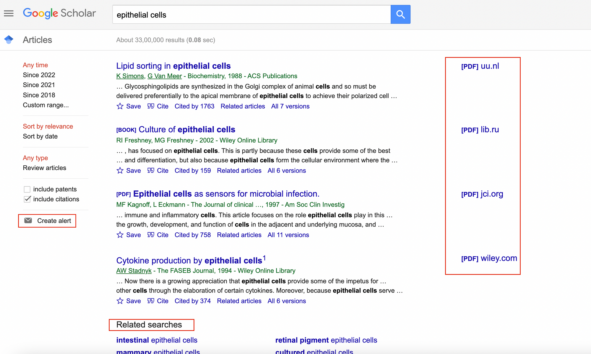
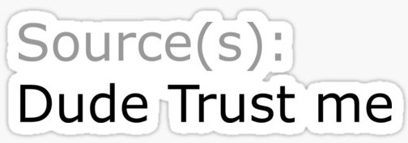
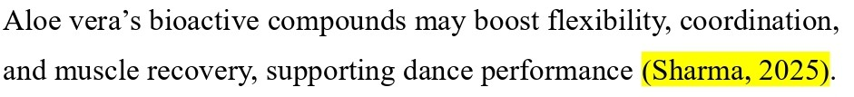
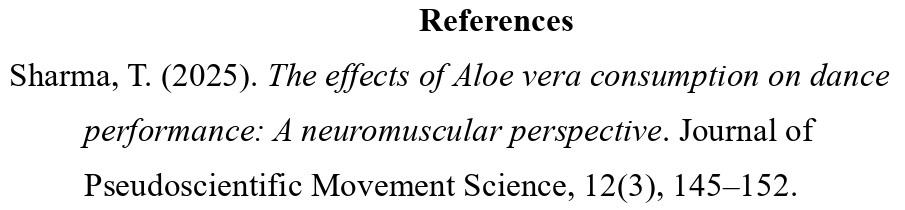
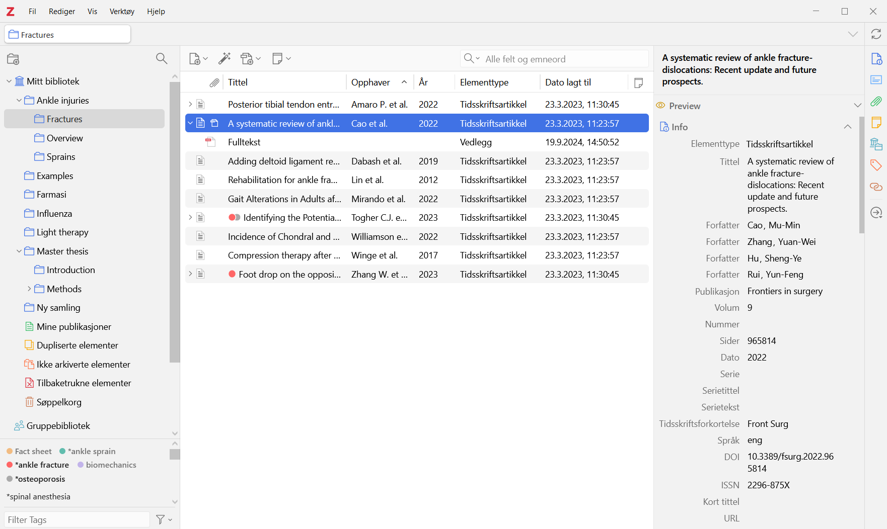

## Licence

::: {.content-visible when-format="html"}
 

  

This work was originally created by Pat Callahan and Dejana Damjanovic under a CC-BY-SA 4.0 [Creative Commons Attribution 4.0 International License](https://creativecommons.org/licenses/by-sa/4.0/deed.en) and a CC0 1.0 [Creative Commons Universal](https://creativecommons.org/publicdomain/zero/1.0/) licence for code snippets. It was subsequently adapted and revised by [Sarah von Grebmer zu Wolfsthurn](https://orcid.org/0000-0002-6413-3895). This current work by [Tejaswini Sharma](https://orcid.org/0009-0000-0305 9751) and Sarah von Grebmer zu Wolfsthurn is licensed under a CC-BY-SA 4.0 [Creative Commons Attribution 4.0 International SA License](https://creativecommons.org/licenses/by-sa/4.0/deed.en). permits unrestricted re-use, distribution, and reproduction in any medium, provided the original work is properly cited. If you remix, transform, or build upon the material, you must distribute your contributions under the same license as the original. Code snippets are dedicated to the public domain and licenced under a CC0 1.0 [Creative Commons Universal Licence](https://creativecommons.org/publicdomain/zero/1.0/). You may use, modify, distribute, and sell the code snippets for any purpose, without permission or attribution. The code snippets are provided “as is”, without warranty of any kind.

:::

::: {.content-visible when-format="pptx"}
This work was originally created by Pat Callahan and Dejana Damjanovic under a CC-BY-SA 4.0 [Creative Commons Attribution 4.0 International License](https://creativecommons.org/licenses/by-sa/4.0/deed.en) and a CC0 1.0 [Creative Commons Universal](https://creativecommons.org/publicdomain/zero/1.0/) licence for code snippets. It was subsequently adapted and revised by [Sarah von Grebmer zu Wolfsthurn](https://orcid.org/0000-0002-6413-3895). This current work by [Tejaswini Sharma](https://orcid.org/0009-0000-0305 9751) and Sarah von Grebmer zu Wolfsthurn is licensed under a CC-BY-SA 4.0 [Creative Commons Attribution 4.0 International SA License](https://creativecommons.org/licenses/by-sa/4.0/deed.en). permits unrestricted re-use, distribution, and reproduction in any medium, provided the original work is properly cited. If you remix, transform, or build upon the material, you must distribute your contributions under the same license as the original. Code snippets are dedicated to the public domain and licenced under a CC0 1.0 [Creative Commons Universal Licence](https://creativecommons.org/publicdomain/zero/1.0/). You may use, modify, distribute, and sell the code snippets for any purpose, without permission or attribution. The code snippets are provided “as is”, without warranty of any kind.
:::

::: {.notes}
**Presenter Notes**: The Creative Commons Attribution–ShareAlike 4.0 license, or CC BY-SA 4.0, allows others to copy, share, and adapt a work in any medium, including for commercial purposes. These permissions are broad and cannot be withdrawn as long as the license terms are followed. The main requirement is attribution: users must give appropriate credit to the original creator, provide a link to the license, and clearly indicate whether any changes were made, without implying endorsement by the original author. In addition, the ShareAlike condition means that if someone modifies or builds upon the work, the resulting material must be distributed under the same CC BY-SA 4.0 license, or a compatible one. Finally, users are not allowed to apply legal or technical restrictions, such as DRM, that would prevent others from exercising these same rights.
:::

---

### Contribution statement

**Creator**: Sharma, Tejaswini ([Orcid-ID: 00009-0000-0305-9751](https://orcid.org/0009-0000-0305-9751))

**Reviewer**: Von Grebmer zu Wolfsthurn, Sarah ([Ordcid-ID: 0000-0002-6413-3895](https://orcid.org/0000-0002-6413-3895))

---

## Prerequisites

**Important:** Before completing this submodule, please carefully read the following prerequisites.

::: {.content-hidden when-format="pptx"}

 

| Prerequisite   |  Description  | Link/Where to find it   |
|------------|------------|------------|
| Zotero and Zotero Connector | Citation tool and extension | [Download Link](https://www.zotero.org/download/) |
| R | Version 4.5. or higher | [Download Link](https://cran.rstudio.com/) |
| RStudio | Version 2026.01.1+403 or higher | [Download Link](https://posit.co/download/rstudio-desktop/) |

:::

::: {.content-visible when-format="pptx"}

| Prerequisite   |  Description  | Link/Where to find it   |
|------------|------------|------------|
| Zotero and Zotero Connector | Citation tool and extension | [Download Link](https://www.zotero.org/download/) |
| R | Version 4.5. or higher | [Download Link](https://cran.rstudio.com/) |
| RStudio | Version 2026.01.1+403 or higher | [Download Link](https://posit.co/download/rstudio-desktop/) |

:::

::: {.notes}
**Presenter Notes**: Before we begin this submodule, please take a moment to review the prerequisite listed here. Based on the previous sessions, you should all have R and RStudio installed, please check which versions you have. One additional pre-requisite is the Zotero tool and the Zotero connector, which we will need for the practical part today. 

**Instructor Notes**: If you are short on time, provide these prerequisites to your learners as part of the preparation for this session. Remind them that they can download Zotero also later when starting the practical part.

:::

---

## Prerequisites (cont.)

- Familiarity with the concept of **literature review**; how and where to access scientific papers, such as *Google Scholar*. 
  

::: {.notes}
**Presenter Notes**: Before we begin this submodule, please take a moment to review the prerequisite listed here.
You should already be familiar with the basic idea of a literature review, including how to search for and access scientific papers, on platforms such as like Google Scholar. Here is an image of the Google Scholar interface with some papers displayed.

**Instructor Notes**: Before proceeding, briefly confirm that learners are comfortable with the concept of a literature review and know how to locate academic articles. If needed, give a detailed overview of the Google Scholar interface, or have them navigate it online by themselves.
:::

---

## Questions from the previous submodule?

::: {.notes}
**Presenter Notes**: Are there any questions from any of the previous sessions?  

**Instructor Notes**:  

- **Aim**:  This first slide is dedicated to clarifying questions from the previous submodule and/or to discuss assignments. 
- Additional slides may need to be added depending on the nature of the homework assignments. 
- Critical for the learning process to ensure that learners are on the same page and have been able to achieve the learning goals of the previous workshop. 
- Not applicable if this set of slides corresponds to the first submodule of a new module. 
:::

---

## Before we start: Survey time!

::: {.notes}
**Presenter Notes**: Before we move on, we’ll take a short survey.
The aim here is simply to understand your current familiarity.

In the next few slides, you’ll see some questions that invite you to reflect on where you’re starting from.
This isn’t a test, and it is not about getting the right answers.

If you’re unsure, that is completely fine, just respond based on what feels closest to your current understanding. 

**Instructor Notes**: Set a low-stakes, supportive tone before beginning the survey. Emphasize that uncertainty is expected and valuable for measuring learning progress.
:::

---

**What is your level of familiarity with citing and referencing scientific papers?**

a. I have never heard of it before.

b. I have heard of it but have never worked with it.

c. I have basic understanding and experience with it.

d. I am very familiar and have worked with it extensively.

---

**How confident do you feel with the Zotero workflow of collection, organisation, and citing?** 
*(1 = Not confident at all, 5 = Very confident)*

a. 1

b. 2

c. 3

d. 4

e. 5

---

## Discussion of survey results

**What do we see in the results?**

::: {.notes}
**Presenter Notes**: Let us have a look at these results.

**Instructor Notes:** The aim is to understand the group’s current standing in terms of knowledge and familiarity with citing literature and using Zotero. Emphasize explicitly that the survey is not about correct or incorrect answers. Avoid evaluating answers or revealing correct ones.
:::

---

## Where are we at?

**Previously**:

- Familiarization with R basics
- Advanced R skills
- Version control with Git
- Collaborative working with GitHub
- Introduction to Quarto

**Up next**:

- Citations and references: What are they and when/how to use them
- Citation management tool: Using Zotero in our workflow

::: {.notes}
**Presenter Notes**: Let us take a moment to see where we are in terms of the topics we have covered so far and what is coming next. 

Previously, you became familiar with the basics of R, built on those skills with more advanced R techniques, and explored version control using Git. You also practiced collaborative workflows with GitHub and got an introduction to Quarto as a reproducible writing and publishing tool.

Up next, we will shift focus to citations and references—what they are, why they are important, and when and how to use them in your work. Following that, we will learn about citation management tools, specifically how to use Zotero to organize your references and integrate them seamlessly into your research workflow.

**Instructor Notes**: Make sure that your learners can picture the broader context we are placing this session in. 
:::

---

## Learning goals

:::incremental
- **Explain** the importance of citing scientific literature and citation tools
- **Familiarize yourself** with different citation formats (CSL)
- **Set up and organize** a personal Zotero library
- **Apply and develop** a referencing workflow in Quarto and RStudio
- **Apply and develop** a referencing workflow in MS Word
:::

::: {.notes}
**Presenter Notes**: This slide outlines the learning goals for the session. At this stage, you’re not expected to fully understand or master all of these points. Think of them as a roadmap rather than a checklist; they show where we’re headed, not what you already need to know. You can use these goals to keep track of your learning, notice what feels clear, and identify areas where you might want to ask questions later.
First, you will first understand the importance of citing scientific literature and using citation management tools.

**Instructor Notes**: Use this slide to set expectations and reduce pressure. Emphasize that learning goals will be revisited throughout the session for reflection and self-assessment. Avoid explaining each goal in detail here; instead, frame them as guiding anchors that will be unpacked gradually through activities and tutorials. You will then become familiar with different citation formats, particularly those based on Citation Style Language (CSL). Next, you will learn how to set up and organize your own personal Zotero library. You will practice importing references, organizing them into collections, adding tags and notes, attaching PDFs, and structuring your library in a way that supports an efficient and manageable research workflow. After that, you will develop a referencing workflow in Quarto and RStudio. Finally, you will develop a referencing workflow in MS Word. Using Zotero’s Word plugin, you will insert citations directly into your text, switch easily between citation styles, and automatically generate and update your bibliography as your document evolves.

**Accessibility Tip:** Pause briefly between them to reduce cognitive load.
:::

---

## What are citations and references?

**A small thought experiment..**

Imagine reading various scientific papers to collect knowledge (*= reviewing the literature*). When you share this knowledge with someone, they would ask: **"Where did you read this?"**

Thus, you need to **cite** the source of your knowledge; in this case, a scientific paper.

::: {.notes}
**Presenter Notes**:  
“Imagine reading various scientific papers to collect knowledge (review of literature).
When you share this knowledge, you’d be asked: “What is the source?” 

Let us imagine a bizarre example: someone claims that eating aloe vera improves your dance skills. 
In everyday life, you might respond, ‘Trust me, bro!’ and leave it at that. But in the scientific world, we need to provide evidence for every claim we make. When you collect knowledge from scientific papers, e.g., your literature review, and share it, others will naturally ask, ‘Where did this information come from?’ or 'Where did you hear this'?
This is why we cite sources: to show the origin of our knowledge and allow others to verify or follow up on it.”

**Instructor Notes**:  Use this humorous, relatable example to introduce the concept of citations and references (feel free to edit the example). Highlight the difference between casual claims and scientific claims to make the importance of referencing concrete. Encourage learners to think of examples from their own fields where citing sources would be necessary.
:::

---

## What are citations and references?

- **Citations** are the **in‑text pointers** to sources you use (e.g., Sharma, 2025). 

::: {.notes}
**Presenter Notes**: Citations are the short pointers you include directly in the text to indicate where a piece of information comes from, typically with an author name and year. Citations help you navigate to the reference list, where you can discover the complete details of the mentioned paper.

**Instructor Notes**: Emphasize the functional distinction between citations and references rather than formatting details. Discuss the workflow of navigating citations while reading a research paper. Use the image as a visual anchor to reinforce where citations appear in a paper. Avoid going into citation styles here; the goal is conceptual clarity, not technical mastery.

**Accessibility Tips**:  
Verbally describe what is shown in the image for learners who may not be able to see them clearly. Allow a brief pause after the definition so learners have time to connect the text explanation with the visual example.
:::

---

## What are citations and references? (cont.)

- Whereas, **references** are the **full bibliographic details** listed at the end of a paper [@aksnes_citations_2019].

::: {.notes}
**Presenter Notes**: References appear at the end of a paper and provide the full details needed to locate the source. This will allow you to access the 'source of the information' and see for yourself what the paper entails. Together, citations and references make it possible for others to trace your claims back to the original research.

This is a fictional citation that does not truly exist. This slide is merely about demonstrating the difference between citations and references. 

**Instructor Notes**: Emphasize the functional distinction between citations and references rather than formatting details. Discuss the workflow of navigating references while reading a research paper. Use the image as a visual anchor to reinforce where references appear in a paper. 

**Accessibility Tips**:  
Verbally describe what is shown in the image for learners who may not be able to see them clearly. Allow a brief pause after the definition so learners have time to connect the text explanation with the visual example.
:::

---

## Why are they needed?

:::incremental
From @aksnes_citations_2019:

- **Show what comes from others:** References show which ideas and words are yours and which are taken from other people, so you do not steal their work and they get credit.

- **Back up what you say:** References point to earlier studies that support your claims, so readers can see where your ideas fit and how trustworthy they are.

- **Let others double-check you:** Clear citations help others follow your steps, spot mistakes or misquotes, and use your work to do new studies.

- **Connect ideas and track influence:** Citations link papers into a big web of knowledge and are often used (not perfectly) to see which work has had a big impact.

:::

::: {.notes}
**Presenter Notes**:  This slide explains why citations and references are needed in research.  
They show which ideas come from other researchers, so credit goes where it’s due and we avoid presenting others’ work as our own.

They also help back up what we say by pointing readers to earlier studies that support our claims.  
Citations make it possible for others to double-check our work, spot mistakes, or build on it in future research.  
They also connect ideas across papers, creating a larger network of knowledge and helping us track how research influences later work. 

And just to practice what we’re preaching: these points are taken from a paper by Aksnes and colleagues from 2019.  
So now you know exactly where this knowledge comes from, and if you don’t believe me, you can always check from the reference at the end.

**Instructor Notes**:  Use this slide to reinforce both the practical and ethical reasons for citing sources. The humorous self-reference helps model good scholarly behaviour in action. Emphasize that citations are not about bureaucracy, but about trust, accountability, and connection within the scientific community.
:::

---

## How to cite and refer to a scientific paper?

:::incremental
- **Citation**: In-text, you usually mention **author and year**. 
  For example: “Recent results support this view (Miller & Rossi, 2021).”

- **Reference list**: After, you provide the full **bibliographic information**:
  1. Author: all authors’ last names and initials. 
  2. Date: When it was published (usually the year).
  3. Title: What the article is called.
  4. Source: Where it was published (journal name, volume, issue, page range, and DOI or URL if online). 
  For example: Miller, A. B., & Rossi, L. M. (2021). Title of the article. *Journal Name, 12(3)*, 45–60. https://doi.org/xx.xxx/yyyy. 
  *Note: Listed in an alphabetical order.* 

:::

::: {.notes}
**Presenter Notes**:  
This slide shows the basic idea of how to cite and reference a scientific paper.  
In the text, citations are usually short and include the author’s name and the year of publication.  
At the end of a paper, the reference list contains the full details, such as the authors, year, title, and where the work was published.These references are typically listed in alphabetical order. 
 
**Instructor Notes**: Keep the focus on structure rather than memorizing formatting rules. Reinforce that citation styles vary across disciplines and that learners should always check departmental or journal guidelines. Use this slide as a bridge to the next one, where citation formats are introduced.

**Accessibility Tips**: Read the example citation aloud and slow down when listing the reference components to reduce cognitive load. 

:::

---

## How to cite and refer to a scientific paper?

- **Citation**: In-text, you usually mention **author and year**. 
  For example: “Recent results support this view (Miller & Rossi, 2021).”

- **Reference list**: After, you provide the full **bibliographic information**:
  1. Author: all authors’ last names and initials. 
  2. Date: When it was published (usually the year).
  3. Title: What the article is called.
  4. Source: Where it was published (journal name, volume, issue, page range, and DOI or URL if online). 
  For example: Miller, A. B., & Rossi, L. M. (2021). Title of the article. *Journal Name, 12(3)*, 45–60. https://doi.org/xx.xxx/yyyy. 
  *Note: Listed in an alphabetical order.* 

**Note:** The *exact formatting* depends on the citation format.

::: {.notes}
**Presenter Notes**:  Do note: the exact formatting depends on the citation style, and we’ll briefly look at some common formats on the next slide. In the current example, the formatting used is APA.

It is also useful to find out which citation style your department or field expects you to use.
:::

---

## Citation styles

::: {.content-hidden when-format="pptx"}

 

| Style                  | Typical fields/usage                     | In‑text example           | Reference list example (journal article)                                                                                |
| ---------------------- | ---------------------------------------- | ------------------------- | ----------------------------------------------------------------------------------------------------------------------- |
| APA                    | Social sciences (e.g., psychology, education)              | (Smith & Lee, 2023)       | Smith, J., & Lee, K. (2023). Title of the article. *Journal Name*, 12(3), 123–145. [https://doi.org/xx.xxx/yyyy](https://doi.org/xx.xxx/yyyy) ​ |
| MLA                    | Humanities (e.g., literature, languages) | (Smith and Lee 123)       | Smith, John, and Karen Lee. “Title of the Article.” Journal Name, vol. 12, no. 3, 2023, pp. 123–145. ​         |
| Chicago (Notes-Biblio) | Humanities (e.g., history, arts (footnotes/endnotes)       | ¹ or (see note 1)         | Smith, John, and Karen Lee. “Title of the Article.” Journal Name 12, no. 3 (2023): 123–145. ​                  |

:::

::: {.content-visible when-format="pptx"}

| Style                  | Typical fields/usage                     | In‑text example           | Reference list example (journal article)                                                                                |
| ---------------------- | ---------------------------------------- | ------------------------- | ----------------------------------------------------------------------------------------------------------------------- |
| APA                    | Social sciences (e.g., psychology, education)              | (Smith & Lee, 2023)       | Smith, J., & Lee, K. (2023). Title of the article. *Journal Name*, 12(3), 123–145. [https://doi.org/xx.xxx/yyyy](https://doi.org/xx.xxx/yyyy) ​ |
| MLA                    | Humanities (e.g., literature, languages) | (Smith and Lee 123)       | Smith, John, and Karen Lee. “Title of the Article.” Journal Name, vol. 12, no. 3, 2023, pp. 123–145. ​         |
| Chicago (Notes-Biblio) | Humanities (e.g., history, arts (footnotes/endnotes)       | ¹ or (see note 1)         | Smith, John, and Karen Lee. “Title of the Article.” Journal Name 12, no. 3 (2023): 123–145. ​                  |

:::

::: {.notes}
**Presenter Notes**: This table shows some of the most common citation formats used across different disciplines.  
You are not expected to learn or memorize any of these.  
Think of this slide as a reference point, showing that citation styles differ depending on the field. 

As an example:

- APA stands for the American Psychological Association. It is widely used in the social sciences, such as psychology, education, and sociology. APA uses an author–date in-text citation format (e.g., Smith & Lee, 2023), which emphasizes the timeliness of research. The reference list follows a structured format with clear rules for authors, publication year, article title, journal title, volume, issue, pages, and a digital object identifier (DOI).

- MLA stands for the Modern Language Association. It is commonly used in the humanities, particularly in literature, languages, and cultural studies. MLA typically uses an author–page number format for in-text citations (e.g., Smith and Lee 123), focusing more on the location within the source than on the publication year. The reference list, called “Works Cited,” has its own specific formatting rules.

- Chicago refers to the Chicago Manual of Style, published by the University of Chicago Press. The version shown here is the Notes and Bibliography system, which is widely used in history and some other humanities disciplines. Instead of parenthetical citations, it often relies on footnotes or endnotes, with a corresponding bibliography at the end of the document. This style allows for more detailed source information in the notes.

- Example comparison APA and Chicago: APA (American Psychological Association) uses an author–date citation system in the text and is primarily used in the social sciences, where the publication year is especially important. Chicago (Chicago Manual of Style), particularly the Notes and Bibliography system, commonly uses footnotes or endnotes and is widely used in the humanities, allowing for more detailed source information and commentary.

**Instructor Notes**: Keep this slide brief and exploratory. Pick out the citation style that is most relevant to your audience and go into more detail, then compare with one other style. Avoid explaining each format in detail; the goal is awareness, not mastery. Encourage learners to visually compare formats and notice recurring elements such as authors, year, title, and source. 
:::

---

## Citation styles (cont.)

::: {.content-hidden when-format="pptx"}

 

| Style                  | Typical fields/usage                     | In‑text example           | Reference list example (journal article)                                                                                |
| ---------------------- | ---------------------------------------- | ------------------------- | ----------------------------------------------------------------------------------------------------------------------- |
| Chicago (Author‑Date)  | Natural and social sciences        | (Smith and Lee 2023, 123) | Smith, John, and Karen Lee. 2023. “Title of the Article.” Journal Name 12 (3): 123–145.                                         |
| IEEE                   | STEM fields (e.g., engineering, computer science)        | "*...sample text...* [13]"                |  [13] J. Smith and K. Lee, “Title of the article,” Journal Name, vol. 12, no. 3, pp. 123–145, 2023.      |

:::

::: {.content-visible when-format="pptx"}

| Style                  | Typical fields/usage                     | In‑text example           | Reference list example (journal article)                                                                                |
| ---------------------- | ---------------------------------------- | ------------------------- | ----------------------------------------------------------------------------------------------------------------------- |
| Chicago (Author‑Date)  | Natural and social sciences        | (Smith and Lee 2023, 123) | Smith, John, and Karen Lee. 2023. “Title of the Article.” Journal Name 12 (3): 123–145.                                         |
| IEEE                   | STEM fields (e.g., engineering, computer science)        | "*...sample text...* [13]"                |  [13] J. Smith and K. Lee, “Title of the article,” Journal Name, vol. 12, no. 3, pp. 123–145, 2023.      |

:::

::: {.notes}
**Presenter Notes**: Here are some more example citation styles.

- Chicago (Author–Date) refers to the Chicago Manual of Style, published by the University of Chicago Press, in its Author–Date variant. This version is commonly used in the natural and social sciences and employs parenthetical in-text citations that include the author’s name, publication year, and page number (e.g., Smith and Lee 2023, 123), with a corresponding reference list arranged alphabetically.

- IEEE stands for the Institute of Electrical and Electronics Engineers. It is widely used in STEM fields, particularly in engineering and computer science, and relies on numbered in-text citations in square brackets (e.g., [13]), which correspond to a numerically ordered reference list formatted in a concise and technical style.
:::

---

## Short exercise

Use a minute to think about which citation format is used in **your field**.

::: {.notes}
**Presenter Notes**: The short exercise is simply to help you identify which citation style is commonly used in your own discipline.

**Instructor Notes**: Use the exercise to prompt independent discovery and reinforce the idea that citation conventions are field-specific. Your audience has likely come across papers and can therefore compare with what they have already seen. 
:::

---

## What are citation tools?

**Citation tools** (or **reference managers**) are apps or software that help you *collect, organize, and format citations* for academic essays or scientific research. Examples include:

- Zotero: [https://www.zotero.org/](https://www.zotero.org/)
- Mendeley: [https://www.mendeley.com/](https://www.mendeley.com/)
- Citavi: [https://www.citavi.com](https://lumivero.com/products/citavi/)

::: {.notes}
**Presenter Notes**:  
Imagine working on an assignment where you’ve opened dozens, maybe even hundreds, of tabs in your browser.  
You are scrolling back and forth, trying to remember where a quote came from or which paper supported which idea, and things start to feel messy and overwhelming.  

This is where citation tools come in. Citation tools, also called reference managers, are apps or websites like Zotero, Mendeley, or Citavi that help you collect, organise, and format your sources in one place.  

**Zotero** is a free, open-source reference manager that helps you collect, organize, annotate, cite, and share research materials. It integrates with browsers to easily save references, supports thousands of citation styles, and works with Word, LibreOffice, Google Docs, and other tools. Its flexible syncing options make it popular among students and researchers who want customization and control over their libraries. It is free and unlimited in local storage space, but paid storage plans for online storage and collaboration exist. This is the tool we will look into today. 

**Mendeley** is a citation manager owned by Elsevier that combines reference management with PDF organization and annotation. It offers a more polished interface and built-in PDF viewing, and its cloud syncing and group sharing make it convenient for collaboration and managing research across devices. However, it is more tied to a proprietary ecosystem and has limits on free storage. There is a free tool, which only comes with basic feautres and limited cloud storage, so you have to choose paid subscription plans for more storage and advanced features. 
**Citavi** is a commercial reference management and knowledge-organization tool especially popular in German-speaking countries. In addition to standard citation management, it includes project planning, task organization, and advanced knowledge structuring features, and integrates closely with Word and research databases. It tends to be more feature-rich for comprehensive research workflows, but it typically requires a license and is focused on Windows (with web support). Citavi is not free, full functionality requires buying a licence. 

**Instructor Notes**: Reinforce the practical benefits of citation tools using everyday student experiences. If prompted, you can explain each tool in more detail, briefly open the websites of each tool and navigate how each tool is unique in its features.
:::

---

## What are citation tools?

:::incremental
**What can they do?**

- Save bibliographic information *from a browser or file*
- Create *in-text citations*
- Add and update references *automatically*

**Why are they useful?** 

- They are *consistent and efficient* (broadly speaking)
- Can produce *different citation formats*
- Can *store attachments*, e.g., pdfs, notes, snapshots, urls

:::

::: {.notes}
**Presenter Notes**: 
What can these tools do? They can save bibliographic information with one click, generate in-text citations, and automatically build your reference list.

They improve accuracy and consistency by remembering all the important details, like the author, year, and title, and formatting every citation the same way, so you’re less likely to make mistakes.

They also save a lot of time. Instead of typing citations and reference lists manually, the tool can generate them for you automatically.  

Another big advantage is that they can handle multiple citation styles. If a course or journal asks for a different format, you can switch styles with just a few clicks, rather than rewriting everything from scratch.

Note that consistency is directly tied to the input you are providing and efficiency to the way you are interacting with the tool. 

Finally, they can **store attachments**, e.g., pdfs, notes, snapshots, urls together with your citation entry locally and remotely. 

**Instructor Notes**: Emphasize that these tools reduce errors, save time, and adapt easily to different citation requirements. Avoid framing them as shortcuts; instead, present them as good scholarly practice that supports accuracy and efficiency.
:::

---

## Questions at this point?

::: {.notes}
**Presenter Notes**: Are there any questions at this point?

**Instructor Notes**: Give some time for your learners to think about questions. Go back to relevant slides if needed. 
:::

---

# Brief overview of Zotero

---

## How does Zotero work?

:::incremental
- **Collecting**: One-click saving of metadata and attachments (pdfs, snapshots) from literature databases, and websites.
- **Organizing**: Items can be grouped into collections, tagged, and searched.
- **Citing and referencing**: Plugins for Word, Quarto, and Google Docs generate in‑text citations and bibliographies automatically.
:::

::: {.notes}
**Presenter Notes**:  
This slide gives a very brief overview of Zotero.  
Zotero is a citation tool that helps you collect, organise, and cite your sources in one place.  
You can save references together with different attachments with a single click from databases or websites, organize them into collections or with tags, and search through them easily.  
Zotero also connects directly to tools like Word, Quarto, and Google Docs, where you insert citations and build your reference list automatically. 

**Instructor Notes**: Keep this introduction surface-level and avoid demonstrating features in detail. The purpose is orientation, not instruction. 
:::

---

## How does Zotero work?

::: {.notes}
**Presenter Notes**: The image shows the Zotero interface, with your saved items in the centre, collections on the left sidebar, and detailed information for each item on the right sidebar.

We’ll only briefly look into this, because you’ll move straight into a hands-on tutorial where you’ll learn how to use Zotero in practice.

**Instructor Notes**: Use the interface image to help learners recognize Zotero when they open it themselves. Let them take a minute to see the interface image to build familiarity. Clearly signal the transition to the practical tutorial, where they will actively work with the tool.

**Accessibility Tips**: Verbally describe the layout shown in the image for learners who may have difficulty seeing it clearly. Reassure learners that they will not need to remember details from this slide, as the upcoming tutorial will walk them through the steps at a comfortable pace.
:::

---

## Your turn!

In this next part, you will familiarize yourself with **Zotero** through **hands-on exercices and activities**:

- Click here: [Zotero: Hands-on practical activities](https://lmu-osc.github.io/introduction-to-zotero/background/zotero_basics.html)

- Or follow: [https://lmu-osc.github.io/introduction-to-zotero/background/zotero_basics.html](https://lmu-osc.github.io/introduction-to-zotero/background/zotero_basics.html)

**Tip:**

Since this is a self-paced tutorial, *take your time* on navigating it; and it can be finished at home as well. We will have a **check-in moment** at the end of this session and discuss any remaining questions.

::: {.notes}
**Presenter Notes**: Now we’ll move on to the tutorial part of the session.
You’ll work individually through a self-paced tutorial — focusing introducing Zotero, how to integrate with other platform, and practical exercises for you.
Take your time as you go through them, and work at a pace that feels comfortable.
There’s no expectation to finish everything right now, and you’re welcome to continue working on them at home.
Use this time to explore, experiment, and revisit earlier ideas as they come up in the tutorials.

**Instructor Notes:** Clearly signal the shift from guided instruction to independent work. Remind learners that the tutorial is self-paced and that progress will naturally vary. Encourage them to ask questions if they encounter difficulties. Some of your learners may only now get to the point of installing Zotero. Make sure to provide support for the installation process when needed. Do walk around the room to check up on the progress of the learners. 
:::

---

## Wrapping up 

- **For later**: Finish the remaining of the 'Introduction to Zotero' tutorial and its exercises at home.

- **For now**: Take one minute to assess your learning progress from the tutorial: 
  
  - What is one key concept about citations or Zotero that became clearer after completing the exercises?
  
  - Which Zotero task can you now perform confidently, and which one still feels challenging?
  
  - How easy has it been navigating different CSL formats?
  

::: {.notes}
**Presenter Notes**: 
Now we revert to our slides to wrap up the presentation. As a homework assignment, you are expected to complete all remaining sections of the Introduction to Zotero tutorial, including every exercise. The goal is to ensure they move from passive understanding to hands-on application of Zotero’s core functions.

The self-reflective questions are designed to encourage metacognitive awareness. You should not simply state whether something was “easy” or “difficult,” but briefly consider why.

The first question checks conceptual clarity about citations and reference management.

The second encourages them to assess their practical competence and identify areas needing further practice.
The third focuses specifically on working with different Citation Style Language (CSL) formats, helping them reflect on flexibility and adaptability in citation formatting.

**Instructor Notes**: Gently nudge the learners back to the tutorial. Emphasize that completion of all tutorial sections and exercises is required. Learners should not skip the “Advanced” or “Zotero Groups” sections. Encourage honest self-assessment in the reflective questions; the goal is learning awareness, not perfection.
Remind learners that facing difficulty is common and part of the learning process.
:::

---

## Looking into the future

1. **Take a minute to think about the following questions, first for yourself, then in a pair:**

- Can you identify some **practical benefits** of using Zotero?

- What **obstacles** do you anticipate in using it consistently?

- How can Zotero support you in your **upcoming projects**?

2. **Share your thoughts with the group.**

::: {.notes}
**Presenter Notes**:  
Now is a time for a short in-class activity and an opportunity to discuss this new skill in an open discussion. 

For this activity, we’ll take about five to seven minutes in total.  

First, take a minute individually to think about these three questions:  

- Can you identify some **practical benefits** of using Zotero?

- What **obstacles** do you anticipate in using it consistently?

- How can Zotero support you in your **upcoming projects**?

After that, we’ll open it up for discussion for about three to five minutes. I’m interested in concrete examples, for instance, an upcoming essay where you could realistically start using it.  There are no right or wrong answers here. The goal is to think honestly about how this tool fits or does not fit into your current workflow.

**Instructor Notes**: Keep the reflection phase quiet before moving into discussion. If participation is slow, prompt with specific contexts (e.g., literature reviews, group projects, thesis preparation).

**Accessibility Tips:** Give learners a short quiet reflection moment before opening discussion. Paraphrase learner contributions clearly and structure them into “benefits” and “barriers” to support comprehension.
:::

---

## Take-home messages

:::incremental

- Citations and references are critical for **tracing sources** and **giving credit** to authors

- Citation tools facilitate your workflow by **collecting, organizing, and formatting citations**, as well as **providing storage** for pdfs or notes

:::

**Make Zotero a habit!**

Zotero can be your go-to tool for saving and citing studies, from assignments to thesis.

::: {.notes}
**Presenter Notes**:
To conclude with some take-home messages, citations and references are essential in academic writing because they allow readers to trace the sources of your information and give proper credit to the original authors. Proper citation is not only an ethical requirement but also strengthens the credibility and reliability of your work, helping others to verify or build upon your research.

Citation tools make this process much easier by collecting, organizing, and formatting your references automatically. They also provide convenient storage for PDFs, notes, and other research materials, allowing you to manage your sources efficiently and integrate them seamlessly into your writing workflow, for example, as we practiced today, RStudio and Quarto and MS Word.

**Instructor Notes**:  
Deliver this slide as a concise closing summary. Reinforce the connection between integrity, transparency, and practical efficiency. Avoid introducing new information; this slide should consolidate key ideas from the session.
:::

---

## Learning goals: Check-In 

**Where are we at?**

:::incremental
- **Explain** the importance of citing scientific literature and citation tools
- **Familiarize yourself** with different citation formats (CSL)
- **Set up and organize** a personal Zotero library
- **Apply and develop** a referencing workflow in Quarto and RStudio
- **Apply and develop** a referencing workflow in MS Word
:::

::: {.notes}
**Presenter Notes**:  Let us pause for a quick check-in. Take a moment to look back at the learning goals and reflect on how comfortable you feel with each one.

If you notice any gaps, this is the right moment to bring them up. Feel free to ask questions or start a discussion so we can address them before moving on.

**Instructor Notes**:   Use this slide to encourage self-reflection rather than evaluation. Emphasize that learners are not expected to feel equally confident about all goals at this stage. Invite questions related to understanding the purpose of citations, the basics of creating citations and bibliographies, or the role of Zotero. Keep the discussion supportive and brief, focusing on clarifying concepts rather than introducing new material.
:::

---

## To conclude: Survey time!

::: {.notes}
**Presenter Notes**: To conclude, we’ll take a short survey.
This post-session survey helps us understand your current level of knowledge about citing literature and using Zotero after completing the submodule.
Please answer honestly based on how confident you feel now. 
**Instructor Notes**: The purpose is to compare pre- and post-submodule responses to evaluate learning progress and the effectiveness of the tutorial. Encourage the learnrs to share in class. Use this space to answer doubts, and provide learning or practice tips if the learners still feel under-confident in any areas.
:::

---

**What is your level of familiarity with citing and referencing scientific papers?**

a. I have never heard of it before.

b. I have heard of it but have never worked with it.

c. I have basic understanding and experience with it.

d. I am very familiar and have worked with it extensively.

---

**How confident do you feel with the Zotero workflow of collection, organisation, and citing?** 
*(1 = Not confident at all, 5 = Very confident)*

a. 1

b. 2

c. 3

d. 4

e. 5

---

## Discussion of survey results

**What do we see in the results?**

::: {.notes}
**Presenter Notes**: Script for the slide here.

**Instructer Notes**:
- **Aim**: Briefly examine the answers given to each question interactively with the group.

- Compare and highlight specific differences in answers between pre- and post-survey answers
:::

---

## References

::: {#refs}
:::

---

## Thanks!
See you next session :)

---

## Additional in-class activity

- **Activity**: Get in a pair, navigate a literature database (Google Scholar), find a paper of your choice with its full text, analyse the citations and the reference list. Note what features you see and share in class.

::: {.notes}
**Presenter Notes**:  Time for a short activity. Pair up and pick a paper from a database like Google Scholar. Take a look at how the citations are formatted in the text and how the reference list is structured. Notice any patterns, differences, or special features. Later, share your observations with the class. 

**Instructor Notes**:  Use this add-on selectively, only if it is needed and time permits. It can be incorporate right after the slide 'What are citations and references?'. Encourage learners to notice key features of citations and references. This reinforces the concepts of citations and references in a real-world context.  

**Accessibility Tip:** Ensure that all learners can access the database and full text (provide links or PDFs if needed). 
:::

---

## CREDiT Contribution Statement - TO DO

Possible roles using the CRediT contribition system or the Zenodo Contribution System: 

**Name main content creator**: Conceptualization, Software, Writing - Original Draft, Visualization. **Sara Lil Middleton**: Writing - Review & Editing, Supervision. **Sarah von Grebmer zu Wolfsthurn**: Conceptualisation, Writing - Review & Editing, Supervision, Project Administration, Validation.

---
