## Licence

<br>

<p style="text-align:center;">
  
</p>

<div style="background-color: #f0f0f0; padding: 0.05em; border-radius: 2px; font-size: 0.4em;">
This work was originally created by [Anna Krystalli](https://github.com/annakrystalli) from [RSE-Sheffield](https://github.com/RSE-Sheffield) under a [MIT licence](https://opensource.org/license/mit) (original repository). It was subsequently adapted by [Malika Ihle](https://www.lmu.de/psyedu/de/personen/kontaktseite/malika-ihle-1f381483.html) during her time at [Reproducible Research Oxford](https://ox.ukrn.org/), with the contributions of [Adam Kenny](https://github.com/Kennyanthro). The overview image is from [Dumitru Uzun](https://duzun.me/tips/git). The exercice is based on the research of [Jen Bright](https://x.com/MorphobeakGeek) who also kindly provided the gifs used in the exercice. It is now maintained by [Malika Ihle](https://www.lmu.de/psyedu/de/personen/kontaktseite/malika-ihle-1f381483.html) and [Sarah von Grebmer zu Wolfsthurn](https://orcid.org/my-orcid?orcid=0000-0002-6413-3895) at the [LMU Open Science Center](https://www.osc.uni-muenchen.de/index.html).  This current work by Elizabeth Waterfield, Sarah von Grebmer zu Wolfsthurn and Malika Ihle is licensed under a CC-BY-SA-4.0 [Creative Commons Attribution 4.0 International SA License](https://creativecommons.org/licenses/by-sa/4.0/deed.en) licence. It permits unrestricted re-use, distribution, and reproduction in any medium, provided the original work is properly cited. If you remix, transform, or build upon the material, you must distribute your contributions under the same license as the original.

Code snippets are dedicated to the public domain and licenced under a CC0 1.0 [Creative Commons Universal Licence](https://creativecommons.org/publicdomain/zero/1.0/). You may use, modify, distribute, and sell the code snippets for any purpose, without permission or attribution. The code snippets are provided “as is”, without warranty of any kind.
</div>

::: {.notes}
**Presenter Notes**: The Creative Commons Attribution–ShareAlike 4.0 license, or CC BY-SA 4.0, allows others to copy, share, and adapt a work in any medium, including for commercial purposes. These permissions are broad and cannot be withdrawn as long as the license terms are followed. The main requirement is attribution: users must give appropriate credit to the original creator, provide a link to the license, and clearly indicate whether any changes were made, without implying endorsement by the original author. In addition, the ShareAlike condition means that if someone modifies or builds upon the work, the resulting material must be distributed under the same CC BY-SA 4.0 license, or a compatible one. Finally, users are not allowed to apply legal or technical restrictions, such as DRM, that would prevent others from exercising these same rights. Code snippets are dedicated to the public domain and licenced under a CC0 1.0 meaning that users can use, modify, distribute, and sell the code snippets for any purpose, without permission or attribution. The code snippets are provided “as is”, without warranty of any kind.
:::

---

## Contribution statement


**Creator**: von Grebmer zu Wolfsthurn, Sarah ({fig-alt="orcid logo"} [0000-0002-6413-3895](https://orcid.org/my-orcid?orcid=0000-0002-6413-3895))

::: {.notes}
**Presenter Notes**: These are the **presenter notes**. You will find a script for the presenter for every slide. In presentation mode, your audience will not be able to see these presenter notes, they are only visible to the presenter. 

**Instructor Notes**: There are also **instructor notes**. For some slides, there will be pedagogical tips, suggestons for acitivities and troubleshooting tips for issues your audience might run into. You can find these notes underneath the presenter notes.

**Accessibility Tips**: Where applicable, this is a space to add any tips you may have to facilitate the accessibility of your slides and activities. 
:::

---

## Prerequisites

::: {.callout-important}
## Prerequisites

Before completing this submodule, please carefully read about the necessary prerequisites.
:::

<div style="font-size: 0.6em;"> 
| Prerequisite   |  Description  | Where to find it   |
|------------|------------|------------|
| Basic R skills | 3.2. Introduction to R - Part I |  Module 3.2. |
| Advanced R skills | 3.3. Introduction to R - Part II|  Module 3.3. |
| Basic Git skills | 3.4. Introduction version control (Git) with RStudio |  Module 3.4. |
| Collaboration on GitHub | 3.5. Introduction to collaborative coding with GitHub |  Module 3.5. |
| Zotero | Reference Management Tool | [Download Link](https://www.zotero.org/) |

</div>

::: {.notes}
**Presenter Notes**: Let us first take a look at these prerequisites. These are important to complete in order to fully understand what will be covered in this submodule. 

**Instructor Notes**: These are the prerequisites for this submodule. Before you get started on this submodule with your audience, you need to ensure that the audience fulfills these criteria. In this session, we will assume that your audience has basic R skills and completed the corresponding workshops. We also assume familiariy with Git and GitHub and that the audience has also completed those submodules. Finally, we assume that, through the previos workshops, participants have downloaded and installed R and RStudio on their local machines, and also have the desktop app for Zotero. 
:::

---

## Setting up Quarto

<div style="font-size: 0.8em;"> 
During this session, we will be using Quarto from RStudio. To set up Quarto, follow these steps:

1. Open RStudio
2. Install the most recent version of Quarto [here](https://quarto.org/docs/download/release.html)
3. In RStudio, go to the Terminal tab and install [tinytex](https://quarto.org/docs/output-formats/pdf-engine.html#installing-tex) by typing `quarto install tinytex` into your terminal
4. Type `quarto --version` into the terminal to check with version of Quarto you are using (should be 1.7 or higher)
</div>

::: {.callout-important}
Make sure to have a recent version of [R](https://www.r-project.org/) (Version 4.4.3 or higher) and [RStudio](https://posit.co/download/rstudio-desktop/) (Version 2025.05.1+513 or higher) installed before you install/update Quarto. For installing R and RStudio, see [here](https://posit.co/download/rstudio-desktop/).
:::

::: {.notes}
**Presenter Notes**: During this session, we will be using Quarto from RStudio. It is therefore necessary for you to have the most recent version of R and RStudio installed. Then open RStudio and install Quarto following the link. Finally, install tinytex, which is a small version of TeX that can be used to build pdf documents with Quarto. You need to install tinytex from the Terminal within RStudio by typing `quarto install tinytex` into the terminal. 

**Instructor Notes**: Leave enough time for the download and installation of Quarto. Guide your students through the installation of tinytex by showing them where to find the Terminal in RStudio. To see which version of Quarto they already have installed, students can type `quarto --version` into the terminal. Quarto versions of 1.7 or higher are suitable for the rest of this tutorial. Quarto may fail or behave unpredictably with older versions of R and RStudio, as newer Quarto features and extensions rely on recent R releases and the current RStudio. Keeping both up to date helps to avoid errors.
:::

---

## Questions from previous submodule?

::: {.notes}
**Presenter Notes**: Are there any questions from what we discussed during the last session? Are there any remaining thoughts or discussion points?

**Instructor  Notes**:

-  **Aim**: clarify questions from the previous submodule and/or to discuss assignments.

- Additional slides may need to be added depending on the nature of the homework assignments.

- It is critical for the learning process to ensure that students are on the same page and have been able to achieve the learning goals of the previous workshop.

- Not applicable if this set of slides corresponds to the first submodule of a new module.
:::

---

## Before we start: Survey time!


::: {.notes}
**Presenter Notes**: Let's start the session by gauging where our Quarto skills are at this point. Please answer honestly and don't worry about having little to no prior knowledge about Quarto. This lesson is for beginners. 

**Instructor Notes**: 

-  **Aim**: The pre-submodule survey serves to examine students' prior knowledge about the submodule's topic.

- Use free survey software such as Particify to establish this. You can use the example survey, edit it or create your own. Make sure to have a QR code for easy scanning, as well as the link displayed on the slides. 
:::

---

**On a scale of 1 to 5, what is your level of familiarity with Quarto (e.g., Quarto concepts, tools within Quarto)? (1 = Not familiar at all, 5 = Very familiar)**

a. 1

b. 2

c. 3

d. 4

e. 5

---


**Which of the following concepts or skills do you feel most confident about when using Quarto? (Select all that apply)**

a. Creating and rendering basic Quarto documents (.qmd)

b. Using YAML headers to customize document settings (e.g., title, author names, output format)

c. Embedding R or Python code chunks and viewing output

d. Producing PDF, HTML or Word documents with Quarto

e. Using Quarto in combination with version control (e.g., Git, GitHub)

f. Including citations and bibliographies via a citation manager

g. None of the above


---

## Discussion of survey results

<br>

<div style="background-color: #f0f0f0; padding: 0.1em; border-radius: 5px; font-size: 1em; text-align: center;">

What do we see in the results?

</div>

::: {.notes}
**Presenter Notes**: Let us have a look at these results. 

**Instructor Notes**:

- **Aim**: Briefly examine the answers given to each question interactively with the group. Use visuals from the survey to highlight specific answers.

**Accessibility Tip**: This survey cannot be completed in an asynchronous setting. 
:::

---

## Where are we at?

:::incremental
**Previously**:
<div style="font-size: 0.9em;">

-  Basic and advanced R skills (data manipulation, plotting, etc.)
-  Introduction to version control using Git
-  Collaborative coding using GitHub
</div>

<div style="background-color: #f0f0f0;">
**Up next**:
<div style="font-size: 0.9em;">
- Combining text, code, and media to create a simple website
- Publishing the website on GitHub
</div>
</div>
:::

::: callout-note
## Quarto and Open Science

**Quarto** is a tool that can help us connect ideas, data, and people through open and reproducible research.
:::

::: {.notes}
**Presenter Notes**: Previously, you have gained skills and experience with R, RStudio, version control with Git, and collaborative work on GitHub. Next, we are moving to a new tool: Quarto. Here, you will learn about a platform that can combine text, code, and media all into one document. We will cover how to create a simple website using different functionalities that Quarto offers.

**Instructor Notes**: Place the topic of the current submodule within a broader context. Consider Quarto as a solution to some existing challenges in Open Research to remind learners what they are working towards and what the bigger picture is.
:::

---

## Covered in this session

:::incremental
- **Key terms and definitions**: Understanding core concepts in Quarto
- **Setting up Quarto**: Opening a Quarto document in RStudio
- **Authoring**: Writing text and structuring content in Quarto
- **Code chunks**: Running and displaying code in Quarto
- **Additional authoring features**: Inserting images and links in Quarto
- **Citations**: Adding citations and bibliography with Zotero in Quarto
- **Publishing**: Sharing your Quarto document on GitHub
:::

::: {.notes}
**Presenter Notes**: This session will cover some basics in how to use Quarto and then some ways it can work with other platforms to perform functions like referencing and publishing. We will first begin by setting up a Quarto document in RStudio, then we will look at important elements: text, code, media, links, and layout. Next, we will work with both Quarto and Zotero for quick and easy citations and, finally, we will look at sharing our work to GitHub. All of these are pertinent steps in learning how to use Quarto to facilitate Open Research practices.

**Instructor Notes**: 

- **Aim**: To establish the core theoretical introduction of submodule topics.

- Pair theoretical aspects with practical exercises and group discussions according to the Think-Pair-Share style and according to Cognitive Load Theory (Sweller, 1980).

- For a 90-minute lesson, the instructor should try to "lecture" for only 20 minutes, learners should work in groups/pairs/on their own for at least 55 minutes of the lesson (+ a 15 minute break).
:::

---

## Learning goals

At the end of this session, you should be able to:

- **Create**, **edit**, and **render** Quarto documents
- **Use key Quarto features** like code chunks, YAML headers, citations, and output formatting
- **Insert citations** and **generate a bibliography** with Zotero directly into the Quarto document
- **Publish** and **share** your work using GitHub Pages 

::: {.notes}
**Presenter Notes**: 

- These are the goals we’re working toward in today’s session. By the end, you should be comfortable creating, editing, and rendering Quarto documents. You’ll also know how to use key features like code chunks, YAML headers, citations, and formatting.

- We’ll practice inserting citations and generating bibliographies using Zotero, and finally, we’ll publish and share our work using GitHub Pages.

- Think of this as the full workflow: first is authoring the document, then comes proper referencing, and finally sharing your work openly.

**Instructor Notes**:

- **Aim**: Formulate specific, action-oriented goals learning goals which are measurable and observable in line with Bloom's taxonomy (Anderson et al., 2001; Bloom et al., 1956)

- Place an emphasis on the **verbs** of the learning goals and choose verbs that align with the skills you want to develop or assess.

- Examples: 
  - Learners will **describe** the process of photosynthesis or
  - Learners will **construct** a diagram illustrating the process of photosynthesis
  
:::

---

## Key terms and definitions

- **.qmd file** 
- **YAML header**
- **Code chunks**
- **Quarto markdown text**

::: {.notes}
**Presenter Notes**: These are some of the key terms that will come up throughout this lesson. What are your associations with each of these concepts? Which ones have you come across before? What could these concepts refer to? What is new to you?
  
**Instructor Notes**: Use the think-pair-share paradigm to examine existing concepts and definitions. learners think for themselves what they associate with each term, discuss collaboratively in pairs and then share their thoughts with the group. Give learners about 10 minutes for this exercise.
:::

---

## Key terms and definitions

::: incremental
- **.qmd file**: The type of file the Quarto document is saved as. 
- **YAML header**: The section at the top of the Quarto document that controls settings like the title, output format, and author.
- **Code chunks**: The sections of the document that contain code (from R or Python, for example) that are used for showing results such as tables, plots, or calculations.
- **Quarto markdown text**: Text written using Markdown syntax to structure and format the content of a document.
:::

::: callout-note
The **YAML header, code chunks, and markdown text** are the **components** of the *.qmd file*.
:::


::: {.notes}
**Presenter Notes**: 

- A Quarto document or file gets the extension of .qmd.

- The YAML header is the section at the top of the Quarto document that controls settings like the title, output format, and author. 

- The code chunks are the sections of the document that contain code (from R or Python, for example) that are used for showing results such as tables, plots, or calculations.

- Then, the Quarto markdown text is the component that combines text, codes, and formatting to create the actual content of the document. These are different components within a Quarto document that are important for rendering.  

**Instructor Notes**: 
- Aim: Introduce key terms and definitions that students will come across throughout the session.

- This first part of the lesson is useful to establish an understanding of important vocabulary- it can be helpful to remind students of the meaning of these terms as they appear in the upcoming sections.

- Move within the framework of the conceptual change theory (the process whereby learners restructure their existing ideas or concepts to make sense of the new information presented to them). Examine existing concepts in relation to some key terms- taking the prior meanings students may have and relating it specifically to new meanings connected to Quarto. Re-examine formation of new concepts at the end of the lesson. 
:::

---

## What is Quarto?

:::incremental
An **open-source scientific and publishing system** that combines text, code and media to produce transparent and reproducible work that can be freely accessed by others.

With Quarto, you can easily: 

- **Analyze** data, text, or research content
- **Share** results and outputs like reports, slides, or websites
- **Reproduce** entire workflows
:::

:::callout-note
## Quarto Website
You can always check out the [Quarto Website](https://quarto.org/) to learn more.
:::

::: {.notes}
**Presenter Notes**: Quarto is an open-source publishing system, this means it is free to use and community-driven. Anyone can download it, contribute towards its improvement, and adapt it. It's designed for combining text, code, and media in a way that makes your work transparent and reprodcible, this means that anyone can read it, rerun the code, and even check the results themselves.

- The 3 key things you can do with Quarto are:
  - Analyze and work with data, text, or research content directly in your document
  - Share or present your results as reports, slides, or even full websites
  - Make your workflow reproducible so others can repeat them. 
  
**Instructor Notes**: Establishing a clear idea of what Quarto is at the beginning of the lesson is useful for building context and purpose.

- Context: how all the parts of Quarto work together to create the intended document(s)

- Purpose: reasons why one would use Quarto (it's versatile, customizable, and shareable)
:::

---

## So, why Quarto?

<!-- TODO:
Comment Felix: Not sure if this side A / side B comparison is the relevant one. Isn't the actual comparison that of a separate code file and a MS Word manuscript, where it is unclear which result comes from which computation? So, the step of integrating both code and narrative text is the crucial one. Comparing the "raw quarto code view" with the "rendered Quarto view" is a bit pointless for me. SvG: agreed, changed it into a table and put emphasis more on the workflow differences. 
 -->

1. **Readability**: Research is more **accessible** when text, analyses, results and code are combined within the same document


| Step            | Traditional workflow | Quarto workflow |
| --------------- | -------------------- | --------------- |
| Write text      | e.g., in an MS Word  document   | Same file       |
| Run analysis    | e.g., in a code editor     | Same file       |
| Insert results  | Copy-paste results         | Automatic       |
| Generate figure  | in statistical programme          | Same file |
| Update results  | Manual redo          | Re-run document |
| Update figure  | Manual redo          | Re-run document |


::: {.notes}
**Presenter Notes**: Let's first answer the question, "How can using Quarto solve common challenges in research?" Research can be messy and scattered sometimes, especially when you want to use different elements like text, code, and media. Researchers often follow a copy-paste workflow, whereby the produce for example a figure with a particular program, then copy the figure over to the manuscript, perhaps in MS word. _so, the results are being explicitly moved to the document. If the results are updated, you have to recompile the figure and re-paste it into the manuscript. This workflow, as you can imagine, is more error prone since it involves a lot of manual labor. 

This is where Quarto comes in! It brings these elements together where we can type, run code, embed media, and cite literature all in one place. In other words, with Quarto, the code that generates results (tables, figures, statistics) lives inside the same document as the text of the manuscript. Here, results are generated inside the document. Analyses are computed in the same document, results and figures are updated automatically, no copy-paste approach. 

**Instructor Notes**: Frame Quarto as the solution to the problem of hard-to-read papers and bodies of work that attempt to integrate text, code, and media with no standard format. Emphasize that the purpose of Quarto is to reduce copy-paste errors or error coming from manual labour.
:::

---

## So, why Quarto?

:::incremental
2. **Reproducibility**: Research is more **reliable** when others can clearly see how results were produced and reproduce them from the original code and data.

<div style="font-size: 0.9em;">
**Current challenges:**

- Research outputs are often separated from the code that generated them  
- Results can become outdated as analyses change  
- It can be difficult to share workflows clearly with others

**How Quarto can help:**

- Keeps text, code, and results in a single, executable document  
- Ensures results are regenerated directly from the underlying code  
- Supports transparent and shareable research workflows
</div>

:::

::: {.notes}
**Presenter Notes**: Inconsistency and scattered files can also be an obstacle when sharing and ensuring your work is reproducible. One of the main challenges in research is that results are often disconnected from the code and data that produced them. As analyses evolve, it’s easy for reported results to become outdated or inconsistent. Quarto helps address this by keeping text, code, and results together, so outputs are always generated from the same analysis and are easier to share and reproduce.
:::

---

## "Rendering" in Quarto

:::incremental

What is **rendering**? The process where Quarto runs the code, combines it with the text, and creates a final output.

- There are two ways to render in Quarto:

  - **Render on Save**: Quarto will automatically re-render the document each time you click "Save"
  - **Manual Rendering**: You have to click on the "Render" each time you want to see the output

:::

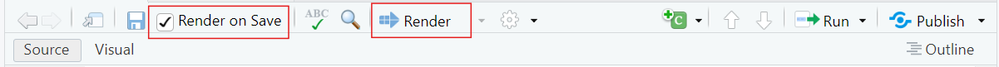{fig-alt="A screenshot of a menu bar in an RStudio workspace with red rectangles highlighting the 'Render on Save' checkbox and 'Render' button."}


::: {.notes}
**Presenter Notes**: Quarto documents can be rendered either manually or automatically when you save your work.

- Manual rendering gives you control meaning you decide when to update the document. This is helpful if you’re making lots of edits and do not want constant re-renders.

- Render on Save automatically updates your document every time you hit Save, which is great for quick feedback and seeing your changes instantly. In this lesson, you can try both to see which workflow feels more comfortable for you.

**Instructor Notes**: It can be more helpful for new learners getting started with Quarto to have the 'Render on Save' option active. Keep the rendered window (the browser with the rendered version of the website) open as well so that they can simply hit save when they make changes and have it rendered automatically to view the changes in real time. 
:::

---

## Quarto modes

You can write Quarto documents in **Source mode** or **Visual mode** in RStudio.

:::incremental
- **Source mode** allows you write directly in plain text/Markdown Syntax, allowing for more control and it's closer to raw code

- **Visual mode** gives a WYSIWYM-style interface which is easier for beginners, but sometimes hides syntax
:::


:::callout-note
Choosing modes is part of the **authoring process**, and it allows you to format the text, add code, and build your document.
:::

::: {.notes}
**Presenter Notes**: Quarto documents can be created and edited in either Source mode or Visual mode. Both modes work with the same file, but they provide slightly different experiences:

- Source Mode is like writing in raw code as you write in plain text or Markdown syntax. 

- Visual Mode shows the formatted text, headings, tables, and the like as they would appear in the final output. WYSIWYM is an acronym for "What You Say is What You Mean" which means that whatever you see in your document will be what you see even when you save or render the document as PDF or as HTML.

- In this lesson, most of our tasks will be done in Source mode, but you’ll also have a chance to try Visual mode so you can compare how the same content looks and feels in each.

- This is part of the authoring process where you are creating the content of the document.

**Instructor Notes**: "Authoring process" is mentioned here but not defined because it will be explained further in later slides.
:::

---

## Creating a Quarto document

These are the steps to **create a Quarto Document** in RStudio:

:::::: columns
::: column
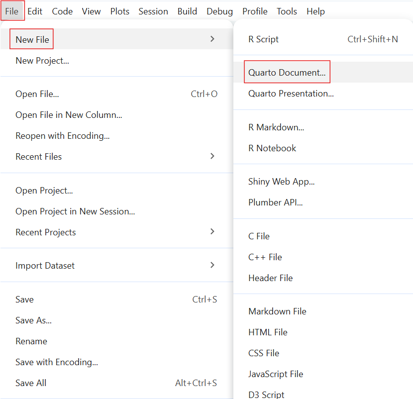{fig-alt="An image of the drop-down menu in RStudio's File tab highlighting the 'New File' option and then the selection of the 'Quarto Document' option."}

:::
::: column
-   Select "`File`"\
-   Select "`New File`"\
-   Select "`Quarto Document`"
:::
::::::

::: {.notes}
**Presenter Notes**: Let us begin with the practical bits! To get started with Quarto in RStudio, the first step is to create a new Quarto document. You do this by going to 'File' on the toolbar and selecting 'New File'. Here, you see options for both Quarto Document and Quarto Presentation. **What's the difference between a Quarto Document and Quarto Presentation**?

- A Quarto Document is best for reports or articles because it produces continuous text like a paper.

- A Quarto Presentation is for creating slide decks, like PowerPoint or Reveal.js slides. For the exercises today, we will select 'Quarto Document'.

**Instructor Notes**: This lesson intentionally starts with a standalone Quarto document rather than an R Project. While Quarto documents can be used inside R Projects, avoiding project setup at this stage reduces complexity and allows learners to focus on the core ideas of Quarto before introducing project-based workflows.
:::

---

## Setting up a Quarto document

:::::: columns
::: column
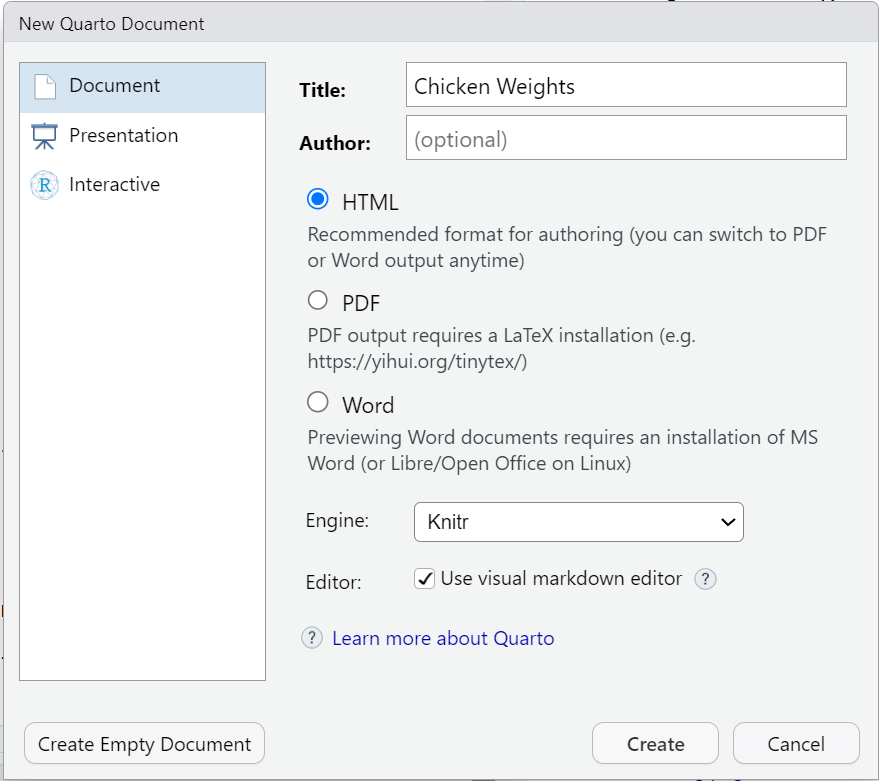{fig-alt="This image shows the setup screen when creating a New Quarto Document for actions such as setting the title, author, and output format."}

:::
::: column

- You can set some of the YAML header details here:
  - Put in the `title` of your document 
  - Choose an `output format` (the default format is HTML)
  - Hit "`Create`"

:::
::::::

::: {.notes}
**Presenter Notes**: This creates your document where you can customize the YAML header, add Markdown text, and insert code chunks. This next step is where you can already set items in the YAML header such as the title and the output format. The default output format is HTML but this can be changed later on by editing the YAML header directly in the document. When you press 'Create', it will open your Quarto document in RStudio where you can begin building.
:::

---

## Practical exercise 1

-   [ ] Create a new folder on your device
-   [ ] Repeat the steps in the previous slides to create a new Quarto Document
-   [ ] Set the title as "Chicken Weights"
-   [ ] Use your name for the author
-   [ ] Select "`File`" → "`Save As...`" and save this Quarto Document in the folder you created 

::: callout-tip
## Why make a new folder?
Creating a folder on your device helps you stay organized! Keeping all the files (such as Quarto documents and images) in one designated folder makes it easier for you to store and retrieve all materials related to the project or exercise. 
:::

::: {.notes}
**Presenter Notes**: We will create a Quarto document using these steps. But first, make a new folder on your device to make it easier for you to store and retrieve files related to the activities today. Then, follow the steps from the previous slide and make a new Quarto document in RStudio. Name the document "Chicken Weights" and put your own name as the author of the document. Then, save this document in the folder that you created.

**Instructor Notes**: Ensure students know where this new folder for the Quarto exercises is located on their device, suggest that they simply right-click on their desktop or 'Documents' folder and click 'New' → 'Folder' so as not to complicate this initial process. This will make it easier for them to find files in later tasks. Then, after creating the Quarto Document, encourage them to save the document right after by selecting "Save As", so they can manually choose the document location (for example, on the Desktop or in a newly created course folder).
:::

---

## Authoring a Quarto document

What is **authoring**? 

- The process of writing and structuring the Quarto document.
- Consider it as a formula: **Authoring = YAML Header + Markdown**

To practice authoring in Quarto, let's start with setting the YAML header and adding markdown text in **Source mode**.

::: {.notes}
**Presenter Notes**: Authoring is combining the YAML header with the markdown text. This means that what you do to customize, add to, and develop your document is the process of 'authoring.'

- The **YAML header** is the section at the very top, wrapped in three dashes. It holds the document’s settings, like the title, author, date, and output format.

- Below that, we use **Markdown text** to write the actual content which are things like headings, bullet points, bold or italic text, and the actual body of your document. 

**Instructor Notes**: Reminding students of the meanings of YAML Header and Markdown text will be helpful especially to those with very little prior knowledge as these are terms that appear very often when working with Quarto. 
:::

---

## Practical exericise 2

-   [ ] In **Source mode**, copy and paste the following into the YAML Header of your document:

``` yaml
---
title: "ChickWeight Analysis"
author: "Your Name"
format:
  html:
    code-fold: false
    toc: true
---
```

::: callout-note
## Output format

In future projects, you can replace "html" to render the document to a different format.

Here is a <a href="https://quarto.org/docs/output-formats/all-formats.html" target="_blank">link to a list of the different output formats</a>, including PDF, docx, ePub for e-book readers, pptx, and much more.
:::

::: {.notes}
**Presenter Notes**: Remember that the YAML Header goes at the top of the document in both Source and Visual Modes. In the YAML header, the "format" field tells Quarto what kind of output to create. Here we have set it to HTML, which means the document will render as a web page. You could choose other formats like PDF or Word, but for this lesson we will stick with HTML so everyone has the same experience. After it is the `code-fold: false` which makes all code is visible by default and `toc: true` to enable a table of contents for easier navigation.

**Instructor Notes**: 
- There is a small clipboard icon at the top-right of the text box. Let students know they can simply click the icon to copy all the text in that specific text box. This icon will appear for every text box moving forward so you can remind them of it the next few times a task requires them to copy the content of a text box.

- In Practical exercise 1, the learners have already set up some of the items in the YAML header (the title, author, and format). So, the extra items (`code-fold: false` and `toc: true`) can either be added OR the section from the slide can simply be copied and pasted to replace the entire YAML section (Note: the "Author" would have to be manually changed here after pasting). 
:::

---

## Authoring: Text formatting

**Basic Markdown Text Formatting:**

-   bullet point: `- bullet point`
-   **Bold:** `**bold**` → **bold**
-   *Italic:* `*italic*` → *italic*
-   ~~Strikethrough:~~ `~~text~~` → ~~text~~
-   `Inline code:` `` `code` `` → `code`

::: callout-note
## Markdown text shortcuts

Here is a <a href="https://quarto.org/docs/visual-editor/options.html">link for the full list of markdown text shortcuts</a> for formatting!
:::

::: {.notes}
**Presenter Notes**: With Markdown text, we can format text with very simple symbols. It works the same way in both Source and Visual mode with the only difference being how you see it while typing. In Source mode you see the symbols, while in Visual mode it looks like regular bold or italic text right away.

To make bullet points, add a single dash (`-`) before each point. Make sure there is a blank line before the first and after the last bullet points for it to render properly. To make a piece of text bold, wrap it in double asterisks (`**`). For italics, wrap the text in single asterisks (`*`). To strike through text, wrap it in double tildes (`~~`). For writing inline code or for text that you want to appear as written (that is, not computed), wrap it in single backticks (`). 
:::

---

## Authoring: Markdown text

<br>

```text
Have you ever wondered what affects a chick's weight? 
This document explores the ChickWeight dataset using R.  
The goal is to compare chick weight across different diets and time points.  
Key steps include:

- Loading the dataset  
- Visualizing growth trends  
- Summarizing results
```

<br>

This is an example of **markdown text**. Let's use it to continue authoring and building our document. 

::: {.notes}
**Presenter Notes**: The words "Markdown Text" may seem technical or complicated for those new to Quarto. But Markdown text can simply be understood as just typing, like writing in any normal document, sometimes with a few simple symbols to add structure or emphasis. 

**Instructor Notes**: The aim here is to help students feel comfortable using Markdown text by showing how simple and familiar it really is.
:::

---

## Practical exercise 3

-   [ ] Copy the markdown text from the previous slide and paste it to your document
-   [ ] Bold the word *"ChickWeight"*
-   [ ] Italicize the phrase *"growth trends"*

::: {.notes}
**Presenter Notes**: To practice formatting the Markdown text, let's copy the text from the previous slide and use simple keyboard shortcuts to bold and italicize certain parts. 

**Instructor Notes**: It's useful to render the document after each practical exercise (where applicable) so students can see the changes as they make them and identify issues. If the 'Render on Save' is active, just hit 'Save' to render the changes. 

- **Solution**: Have you ever wondered what affects a chick's weight? This document explores the **ChickWeight** dataset using R. The goal is to compare chick weight across different diets and time points.  
Key steps include:

  - Loading the dataset
  
  - Visualizing *growth trends*
  
  - Summarizing results

:::

---

## Authoring: The callout box

**Quarto callout boxes** can highlight important aspects of your document or provide supplementary information.

<div style="font-size: .8em;">

::: callout-important
## Important with Title

This is an example of a callout box to highlight particularly important information using `callout-important`
:::

::: callout-tip
## Tip with Title

This is an example of a callout box to give important tips using `callout-tip`
:::

::: callout-note
## Note with Title

This is an example of a callout box to include additional information or context using `callout-note`
:::

::: callout-warning
## Warning with Title

This is an example of a callout box to include additional information or context using `callout-warning`
:::

</div>

::: {.notes}
**Presenter Notes**: Callout boxes are a way to highlight important information in your document. They stand out visually, so readers immediately notice them. You can use them to emphasize tips, warnings, examples, or key takeaways.

- Observe that the look of the callout boxes changes depending on if "-important," "-tip," "-note" or "-warning" follows the word "callout".

**Instructor Notes**:  These are just examples of callout boxes. How to actually create one will be covered in the next slide/task.
:::

---

## Authoring: Inserting a callout box


Here is the markdown text for inserting a **callout note** box:

```{.textbox}
::: callout-note
## Based on Real Data

The ChickWeight dataset in R is based on real experimental data.
:::

```

Important elements:

- Begins and ends with three (!) colons `:::`
- Specifies the style of the callout box with "`-note`"
- The title of callout box is made by using `##`

::: {.notes}
**Presenter Notes**: This is what the Markdown syntax looks like for a callout box. To start and end the callout box, we use 3 colons (`:::`). We will choose the 'note' style by adding the word "note" to the callout. Inside the box, you can add a heading using ## and then add text below it. These aren't just for highlighting important information but can be used for supplementary or by-the-way information as well as warnings.

**Instructor Notes**: To change the type of callout box, learners have to replace callout-note with either:

- callout-warning

- callout-tip

- callout-important
:::

---

## Practical exercise 4

-   [ ] Copy and paste the markdown text from the previous slide into your Quarto document to add this `callout-important` box.

<br>

<div style="font-size: .6em;">
When rendered, it should look like this:

::: callout-important
## Based on Real Data

The ChickWeight dataset in R is based on real experimental data.
:::

</div>

::: {.notes}
**Presenter Notes**: Let's add a callout-important box to our document, do this by copying the text from the previous slide and pasting it into your document. Note the important elements and specific details in the formatting (for callout boxes and for all authoring features): beginning and ending with 3 colons (`:::`); single space between the first set of colons and the words "`callout-important`"; and a single space between `##` and title. When rendered, observe how the callout boxes sets its contents apart from the rest of the document to draw the reader's attention. 

**Instructor Notes**: The aim here is to understand and practice the specific format of a callout box and how it is useful. Solution: 

- Line 1: "`::: callout-important`"

- Line 2: ## Based on Real Data

- Line 3: The ChickWeight dataset in R is based on real experimental data.

- Line 4: `:::`

**Troubleshooting:** Remember to add an **empty line** before and after the callout boxes.
:::

---

## Code chunks

:::incremental
= **Sections of the document** where you can **write and execute** pieces of **code**

- There are multiple ways to insert **code chunks**:

  - Simply click the green *Insert Code Chunk* button on the toolbar {fig-alt="A screenshot of an RStudio toolbar with a red rectangle highlighting the 'Insert a new code chunk' action button which is a green square with a the letter C in its center and a green plus icon to its top-left."} 

  - You can manually type 3 back ticks \`\`\` then {r} to start a coding chunk, enter your code, then end the chunk with 3 back ticks

  - You can use the keyboard shortcut Ctrl + Alt + I (Windows/Linux) or Cmd + Option + I (Mac) to insert a code chunk then simply enter your code
  
:::

::: {.notes}
**Presenter Notes**: Code chunks are sections of a Quarto document where you can run code directly inside your file. They are marked by three backticks followed by the language name, like {r} or {python}. So, using {r} to start the Code Chunk indicates that the coding language that we're using is R. These let us write and execute code, and then display the results, such as tables, plots, or calculations, right in the document. Code chunks make it possible to combine text and analysis in one place, so the document stays reproducible and dynamic. 

**Instructor Notes**: Use ```{r} for this lesson as students will be using R Studio and possession of some background knowledge in R is assumed. Sometimes the third backtick only appears once the spacebar is pressed.
:::

---

## Inserting code chunks

<br>

```{.textbox}
summary(ChickWeight)
```

<br>

```{.textbox}
library(ggplot2)
ggplot(ChickWeight, aes(x = Time, y = weight, color = Diet)) +
  geom_line(aes(group = Chick)) +
  labs(title = "Chick Growth Over Time")
```

<br>

These are examples of **R code chunks**. Let's use these to insert code chunks in our document. 

::: {.notes}
**Presenter Notes**: For example, here we are summarizing the ChickWeight dataset, and below, we’re using the `ggplot2` package in R to create a visualization of chick growth over time. Notice how the code is written inside a chunk, and when rendered, Quarto automatically runs the code and shows the results in your output. This is what makes Quarto so powerful, it combines text, code, and results all in one place. It's also possible to see the output of the code before rendering by clicking the small, green arrow at the top-right corner of the code chunk. Hover over it and it would say "Run Current Chunk." 

**Instructor Notes**: 
Make sure you have "ggplot2" package installed and loaded before running these codes. do so by running install.packages("ggplot2") and library(ggplot). 

If you'd like to simplify the concept of code chunks and have students feel less intimated to use it, you can begin by having them run "1 + 2" in a code chunk and render it to see Quarto run this simple calculation in the output. 
:::

---

## Practical exercise 5

-   [ ] Insert the code from the previous slide in *two separate code chunks*

. . .

It should look like this:

````
```{{r}}
summary(ChickWeight)
```

```{{r}}
library(ggplot2)
ggplot(ChickWeight, aes(x = Time, y = weight, color = Diet)) +
  geom_line(aes(group = Chick)) +
  labs(title = "Chick Growth Over Time")
```
````

::: {.notes}
**Presenter Notes**: Let's run the functions from the previous slides by putting them in code chunks. First create the code chunk then copy and paste the text from the previous slides containing the R functions. Try using different methods to insert coding chunks for this exercise. You don't need to hit Ctrl + Enter (Windows) or Command + Enter (Mac) to run the code. After placing it in the coding chunk, rendering the document will run the code and print the output. Render the output and observe how the code appears together with the markdown text from the previous activities, this is what makes Quarto so useful, it gives you one place where you could combine text and code neatly into a single document.

**Instructor Notes**: Note that the code is in two separate text boxes/coding chunks for teaching purposes but can actually both be put in 1 coding chunk. You do not have to start a new coding chunk each time you want to use a different R function. 
:::

---

## Adjusting the code chunks

Adjust how the code is portrayed by **editing the YAML header**:

:::::: {style="display: flex; gap: 1em;"}
::: {style="flex: 1;"}

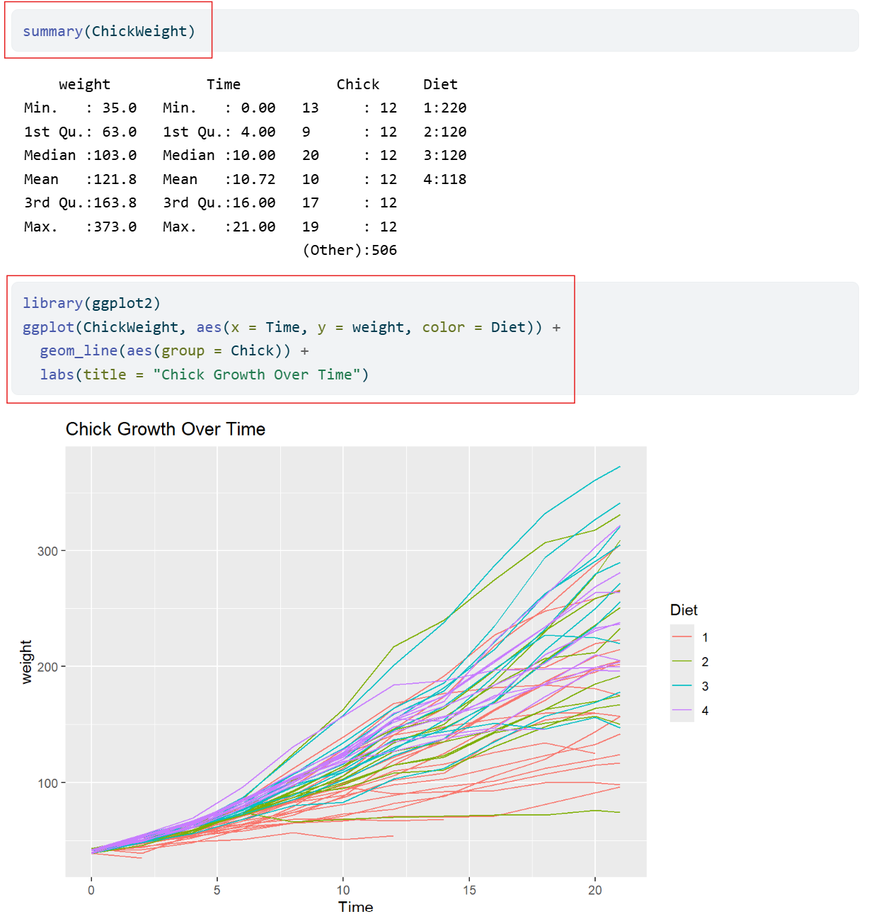{fig-alt="A screenshot of a summary table displaying the weight, time, and diet information for chicks. Below the table is a line graph with multiple colorful lines. Red rectangles highlight the R code for both the summary table and graph."}

:::
::: {style="flex: 1;"}

- Currently in our YAML header, we have it set to `code-fold: false` which means the code is visible and not collapsible. 

:::
::::::

::: {.notes}
**Presenter Notes**: Quarto gives us several options for controlling how code appears in our documents. For example, we can choose whether to show or hide the code itself, whether readers can fold code open and closed, or whether only the results are shown. These settings don’t change the analysis, but just change how it’s displayed. This flexibility is helpful because sometimes we want to highlight the process by showing the code, and other times we want readers to focus on the results. In open research, showing the underlying code isn’t just a technical choice, it’s important for building trust and reproducibility.

**Instructor Notes**: If useful, clarify that "not collapsible" means that we cannot chose to hide the code, meaning we cannot choose to fold it closed (as we will see when we set it to `code-fold: true`)
:::

---

## Code chunks display settings

Here are some other **code display settings** that we can incorporate into our YAML header: 

-   `code-fold: true` collapses the code so the reader can expand it
-   `code-tools: true` adds the functions "show code" at the top of the page and "copy" next to the chunks
-   `echo: true` both the code and the output is visible

Let's edit the YAML header to make the code chunks **collapsible** and add **code tools**.

::: {.notes}
**Presenter Notes**: Here are some ways we can change how code is displayed in our rendered website. `echo: true` and `code-fold: false` both affect how code is shown, but in different ways. `echo` decides if the code prints at all, while `code-fold` lets readers toggle it open or closed, deciding whether the code can be hidden or expanded. `code-tools` gives extra functions to the parts of code in the document with the options "show code" and "copy" next to the coding chunks. 

**Instructor Notes**: It's easy to confuse `echo` and `code-fold` because they both deal with code visibility. Be clear on the difference.
:::

---

## Practical exercise 6

In the **YAML header**, under the `html` section:

-   [ ] Change `code-fold: false` to `code-fold: true`
-   [ ] Add `code-tools: true`

::: {.notes}
**Presenter Notes**: Currently in our YAML header, we have it set to `code-fold: false`. This means the code is visible and not collapsible, but we can change that. Find it in the YAML under `html` and simply replace the word "false" with "true." Then, add a new code setting by inserting "`code-tools: true`" right under it. 

**Instructor Notes**: Engage students by asking for possible reasons why one would want their code to be visible or not (optional). 

**Solution**: The new YAML header should look like this:

``` yaml
---
title: "ChickWeight Analysis"
author: "Your Name"
format:
  html:
    code-fold: true
    code-tools: true
    toc: true
---
```
It does not matter the order in which the new additions are placed once they are under the `html`. 

:::

---

## What have we learned so far?

Here's a quick recap of what we have learned in this lesson so far: 

✅Create a new Quarto Document in RStudio

✅Edit and render the Quarto Document as a website

✅Use key Quarto features like code chunks, YAML headers, and output formatting

---

## Pre-break quiz: Your turn!


::: {.notes}
**Presenter Notes**: Before the break, let's take a moment to review the things we covered in the first part of this lesson. This survey has a few simple recap questions about what we’ve learned so far about using Quarto. The goal isn’t to test you, but to help you reflect on what you’ve learned and for me to see if anything needs a bit more clarification.

**Instructor Notes**: Aim: This pre-break survey serves to examine students' current understanding of key concepts of the submodule <br>
- Use free survey software such as or other survey software (Menti, particify, formR) to establish the following questions. It's important to have an idea of these key terms because they will reappear many times throughout the rest of this lesson.
:::

---

**What's the typical format of Quarto Markdown document?**

a. .png file

b. .qmd file

c. .docx file

d. .mp3 file


---

**In a Quarto document, what is the YAML header?**

a. Summarizes the document into a single line

b. A place inside the Quarto document to store notes

c. The title of the document

d. The "settings" of the document

---

**In a Quarto document, which component is primarily responsible for formatting narrative text (e.g., headings, bold text, lists, and paragraphs)?**

a. Markdown text

b. YAML header

c. Code chunks

d. All of the above

---

# Break! 10 minutes

---

## Post-break survey discussion

<br>

<div style="background-color: #f0f0f0; padding: 0.1em; border-radius: 5px; font-size: 1em; text-align: center;">

What do we see in the results?

</div>

::: {.notes}
**Presenter Notes**: Let's discuss the survey answers and clarify any questions before moving on to the next section.

**Instructor Notes**: The aim of this suvery is to clarify concepts and aspects that are not yet understood. Highlight specific answers given during the survey and also use this time to clarify any confusions or questions on specific topics students may have from the first part of the session. Guidance on interpreting the results:

- If more than 80% of the learners select the correct response option, show which one it is and move on.

- If less than 80% of answers are correct, let them discuss with each other for 1-2 minutes which one they selected, and why, and afterwards let them re-take the question. If they`re above 80% correct the second time, move on, else show the correct response and explain why it is correct (plus maybe why the others are not).

- If more than 30% select a specific distractor answer, discuss it in class.
:::

---

## Additional authoring features

:::incremental
Quarto offers additional **authoring features** that make it more versatile and comprehensive. These include:

- Adding **links** and **hyperlinking** text
- Embedding **media**, for example **images**
:::

::: callout-note
## Commonly used authoring features

If you want to learn more about advanced authoring features, click [here](https://quarto.org/docs/authoring/markdown-basics.html) for commonly used markdown syntax for additional authoring features.
:::

::: {.notes}
**Presenter Notes**: Beyond writing plain text, Quarto also incorporates additional features like hyperlinked text and inserting images or videos. These improve how our document communicates. Hyperlinks let us connect to sources or other sections; and media like images and video help explain complex ideas more clearly. Using these features thoughtfully improves both the usability and the overall look of the document.

**Instructor Notes**: If your learners want to know more about additional possibilities with markdown, direct them to the link in the callout box. 
:::

---

## Inserting links

Link with title: `[title](link)`

-   `[Quarto Website](https://quarto.org)` → [Quarto Website](https://quarto.org/)
-   `[Click here to see more information on reveal.js](https://revealjs.com)` → [Click here to see more information on reveal.js](https://revealjs.com/)

Link without title: `<https://link>`

-   `<https://www.markdownguide.org/>` → <https://www.markdownguide.org/>
-   `<https://github.com/>` → <https://github.com/>

::: {.notes}
**Presenter Notes**: You can insert a link with a title using square brackets for the title (that is, what appears to the reader) and parentheses for the URL. This is helpful when you want the link to be descriptive or if you want to hyperlink written text. You can also add a link without a title by simply wrapping the URL in angle brackets (<...>). This shows the raw link, which is fine if the URL itself is clear and concise enough. A good rule of thumb is to use titled links for readability, and untitled links when you want to show the exact URL.
:::

---

## Inserting images

-   Image by itself with no caption: ``````

{width="20%" fig-align="left" fig-alt="An image of 3 yellow chicks sitting in the grass."}

-   Image with a caption below it: ``````

{width="20%" fig-align="left" fig-alt="An image of 3 yellow chicks sitting in the grass."}

::: {.notes}
**Presenter Notes**: A benefit of using Quarto is the ability to easily add media, such as images, to your documents. You can add the image by itself with no additional text by entering ``. The *path* tells Quarto where to find the image on your device. If the image is stored in the same folder as your .qmd file, you only need to use the image’s file name. If the image is inside a subfolder (for example, a folder within the folder labelled "Images"), then you just include the folder name in the path, for example *images/picture.png*. <br>
Images can also be inserted with a caption placed below it. Do so by typing the caption in the square brackets [] after the exclamation point !. This helps with clarity and accessibility, since captions explain the relevance of the image. It is also useful in reports, presentations, or academic writing where figures must be labeled. 
:::

---

## Inserting images

You can even add a link to an image so that when you click anywhere on the image, it redirects you to that website. 

-   Image with link: ```[](link)```

[{width="40%" fig-align="left" fig-alt="An image of 3 yellow chicks sitting in the grass."}](https://journals.plos.org/plosone/article?id=10.1371/journal.pone.0127819)

::: {.notes}
**Presenter Notes**: Images can also be inserted with links embedded in them. This allows readers to click and explore more details (for example, linking a screenshot to a website or dataset). This helps keep documents concise while still offering extra resources for those who want them. Having a caption in this case is not necessary but recommended to provide context for what link is attached to the image. 
:::

---

## Practical exercise 7

-   [ ] <a href="images/05_Chick_Pic.png" download>Click this link to download the image</a>
-   [ ] Save the image to your main folder with the Quarto document files
-   [ ] Copy and paste the markdown text below to insert an image with a caption (edit path if needed):

<br>

```{.textbox}

```

::: {.notes}
**Presenter Notes**: For this task, click the link and the image will automatically download. The text inside the square brackets is the caption, and the text inside the parentheses is the path to the image file. Reminder that the path tells Quarto where to look for the image on your deivce. If your image is saved directly in the same folder as your .qmd file, you only need the file name. If it’s in a subfolder, include the folder name in the path.

**Instructor Notes**: The aims are to reinforce how to add images, insert captions, and how paths work. Setting the path can be tricky depending on where the files are located. It’s a good practice to save these files in the same main folder as your Quarto document files (ideally in a dedicated subfolder named "images" to keep paths organized and easy to manage). If students saved and placed their main folder earlier, then locating it should be easy. In the Task above, the text says "images/chickpic1.png" - this assumes the picture is saved in a folder called "images" in a main folder containing all the Quarto document files.
:::

---

## Adding citations 

:::::: {style="display: flex; gap: 1em;"}
::: {style="flex: 0.5;"}

{width="80%" fig-alt="An image of Zotero's logo. The letter Z in the color red is placed in the center of a white square with rounded edges. The lower-right corner is lifted to reveal written words underneath and four colored tabs are placed around the square."}

:::
::: {style="flex: 1.5;"}

What is **Zotero**? A free **reference management tool** to collect, organize, cite, and share research sources.

:::
::::::

- You can use **Zotero** in RStudio to easily insert citations into your Quarto document.

::: {.notes}
**Presenter Notes**: Zotero is a reference manager that helps you collect and organize research articles, books, and other sources. When you connect Zotero to Quarto, you can easily insert citations while writing and then automatically generate a reference list at the end. This saves time and reduces errors compared to typing citations manually.

**Instructor Notes**: If applicable, sign post the materials for Zotero to your learners. 
:::

---

## Adding citations with Zotero

To insert a citation:

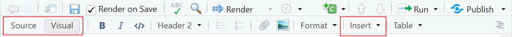{fig-alt="A screenshot of an RStudio toolbar with red rectangles highlighting the 'Source/Visual' mode options and the 'Insert' function."}

-   Switch to the "`Visual Editor`" mode

-   → Press the "`Insert`" button in the toolbar and select "`Citation`"

-   → In the **Zotero** library, select the citation and click "`Insert`"

What you will notice:

- `bibliography: references.bib` will be added to the YAML header

- After rendering, a **reference list or bibliography** will be *automatically generated at the end of the document* with the citations used.

::: {.notes}
**Presenter Notes**: To add citations in Quarto, you’ll need Zotero installed on your device. Then, in RStudio, switch to the Visual Editor, which makes citation insertion easier. Simply go to the toolbar, click Insert → Citation, and you’ll be able to search your Zotero library directly. Once you add citations in the text, `bibliography: references.bib` will be added to the YAML header and Quarto will automatically generate a reference list or bibliography at the end of the document. This means that you do not have to format it manually.
:::

---

## Adding citations with Zotero

:::::: {style="display: flex; gap: 1em;"}
::: {style="flex: 0.5;"}
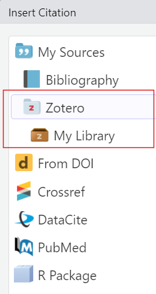{fig-alt="A screenshot of the dropdown menu under 'Insert' with a red rectangle around the 'Zotero/My Library' option."}

:::
::: {style="flex: 1;"}
- You can select citations straight from the folders in your **Zotero library**

:::incremental
- Each citation is assigned a short citation key based on the author and year (for example, "`pauwels2015`").

- Quickly cite in your document's text using the citation key:
  - For regular citation, type @ followed by the citation key, wrapped in square brackets (for example, `[@pauwels2015]`).
  - For in-text citation, type @ followed by the citation key, for example `@li2016`. No square brackets.

:::
:::
::::::

::: {.notes}
**Presenter Notes**: When you click "My Library," it mirrors what folders you've created in Zotero Library. This helps you navigate to the folder where the citation is stored. After inserting a citation once, you see what citation key is assigned to it for easier referencing later in the text. The way the citation key is written is different for regular and in-text citations. 

**Instructor Note**: The Zotero program does not need to be open on the device for the "Zotero" option to show up in RStudio. But if it's not appearing like it does in the image, opening the program on the device may help.
:::

---

## Practical exercise 8

Let's practice adding a citation using **Zotero**.

- [ ] [Follow this link to an article on diets and broiler chicks](https://journals.plos.org/plosone/article?id=10.1371/journal.pone.0127819) 
- [ ] Add the citation to your Zotero Library

```{.textbox}
Diet affects chick body weight. In this study, low-energy feed made fast-growing chicks lighter, while slower-growing chicks compensated by eating more 
```

- [ ] Copy the text above
- [ ] In **RStudio**, paste it into the Quarto document and place the cursor at the end of the sentence. This where in the sentence you want to place the citation.

::: {.notes}
**Presenter Notes**: Let's use Zotero with RStudio to insert citations in our Quarto document and generate a bibliography, this simplifies the referencing process. Follow these steps to add a citation to your Zotero library and add some information extracted from it to your Quarto document. 

There are several ways to add a citation to your Zotero library but an easy way is using the 'magic wand' (adding the item by its identifier). Here, you can just copy and paste the DOI of the study, hit Enter, and it will be added to Zotero. 

After adding the citation to your Library in Zotero, copy the text provided and place it in your Quarto document. Wherever the cursor is when you click "Insert" is where the citation will be placed. So, have the cursor at the end of the sentence. 

**Instructor Notes**: The DOIs of the articles in these tasks will be clearly visible so the 'magic wand' method for adding citations in Zotero is recommended.

With the addition of `bibliography: references.bib`, the new YAML header will look like this:

``` yaml
---
title: "ChickWeight Analysis"
author: "Your Name"
format:
  html:
    code-fold: true
    code-tools: true
    toc: true
bibliography: references.bib
---
```

:::

---

## Practical exercise 8

- [ ] In **Visual Mode**, click "`Insert`" on the toolbar and navigate to your library in Zotero
- [ ] Find the article you just added to the Zotero library and select it
- [ ] Click "`Insert`" to add the citation

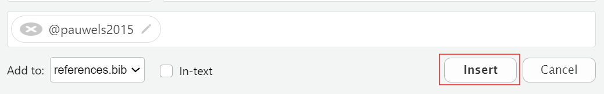{fig-alt="An image showing the citation key 'pauwels2015' and a red rectangle highlighting the 'Insert' option."}

::: {.notes}
**Presenter Notes**: Follow these steps to add the citation to the end of the text. It is possible to add citations in Source mode, but it is easier and more efficient to do it in Visual mode. This is also a good opportunity to see all the work you've done so far in the Quarto document but now in Visual mode. Cick "Insert" and then "Citations". You will see your Zotero library in the side panel. Here, you can select the citation you want to add and then click "Insert" 
:::

---

## Practical exercise 9

Now, let's practice adding **in-text** citations!

- [ ] [Follow this link to another article on diets and broiler chicks](https://journals.plos.org/plosone/article?id=10.1371/journal.pone.0153859#:~:text=In%20conclusion%2C%20HDND%20improved%20the,diet%20adversely%20affected%20bone%20mineralization.) 
- [ ] Add the citation to your Zotero library

```{.textbox}
 found that broiler chicks fed a higher nutrient-density diet gained more weight and did so more efficiently.
```
- [ ] Copy the text above 
- [ ] In **RStudio**, paste the text then place your cursor at the beginning of the sentence

::: {.notes}
**Presenter Notes**: Follow these steps to place an in-text citation at the beginning of the sentence. This is another article, so you will have to follow this new link and add it to your Zotero library.

- In-text citation is a short reference within the sentence itself that points to the full source that you're citing.
:::

---

## Practical exercise 9

- [ ] Ensure you are still in **Visual Mode**
- [ ] Click "`Insert`" and find this new article in the Zotero Library
- [ ] Check the box next to "`In-text`"

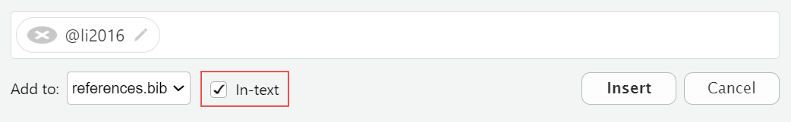{fig-alt="An image showing the citation key 'li2016' and a red rectangle highlighting the ticked In-text checkbox."}

- [ ] Click "`Insert`" to add an in-text citation


::: {.notes}
**Presenter Notes**: The steps to add an in-text citation is almost identical to adding a regular citation with an additional step of checking the "In-text" box before inserting the citation. 
:::

---

## Adding citations with Zotero

:::::: columns
::: column
In your output, you should now have:

- A citation
- An in-text citation 
- A reference list (bibliography)
:::
::: column
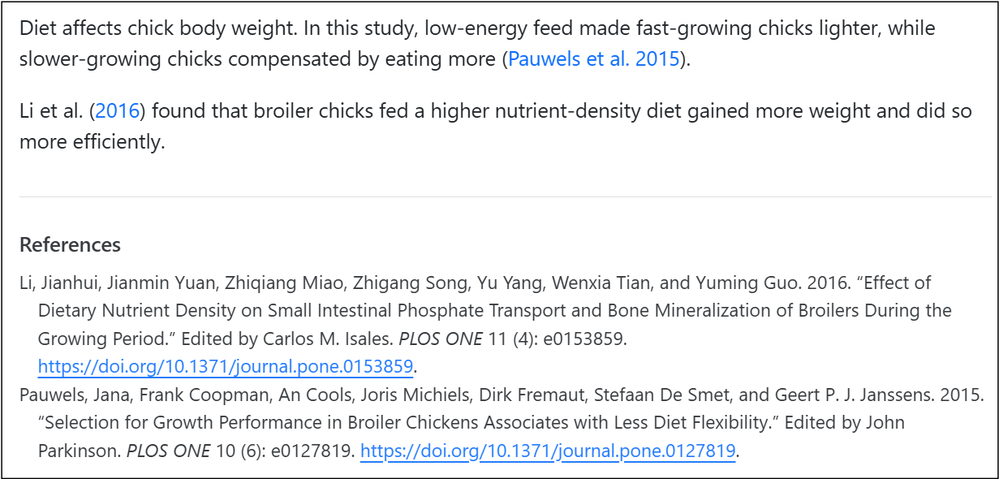{fig-alt="A screenshot showing two sentences about chick body weight including citations and a bibliography below."}

:::
::::::

::: callout-note
## Changing the citation style

You can change the citation style by using Citation Style Language (csl) files directly from the Zotero website. For example, putting "`csl: https://www.zotero.org/styles/apa`" in your YAML changes the citation style to APA.
:::

::: {.notes}
**Presenter Notes**: When you render, you should have three new elements in your Quarto website: a citation, an in-text citation, and a reference list or bibliography at the end. As you can see, Quarto does most of the heavy lifting as long as you insert citations correctly and the bibliography builds automatically. Also, if you ever need to follow a specific format, like APA or Chicago, you can easily change the citation style by adding a CSL file in your YAML. It can be a link directly to the Zotero website or archive. 
:::

---

## Publishing

**What is publishing with Quarto?** 
<br>

:::incremental
= the process of sharing the rendered documents or projects online so it can become accessible to others.

- You can publish the rendered html file to:
  - GitHub Pages
  - A personal website
  - Quarto Pub
- Note: Of course you can always render to PDF and upload that to any preprint server or your personal website. But here we will focus on publishing to GitHub Pages.
:::

::: callout-note
## List of publishing services

Here is a [link for a list of publishing services and more information](https://quarto.org/docs/publishing/index.html)!
:::

::: {.notes}
**Presenter Notes**: Publishing in Quarto is all about making your work accessible to others. Once you have created and rendered your document, you can share it online so that collaborators, students, or the wider community can view it. Quarto supports multiple publishing options, including GitHub Pages, your own personal website or Quarto Pub.

**Instructor Notes**: Keep in mind that the key takeaway here is publishing turns your local work into something that can be accessed from anywhere. What is Quarto Pub? It's is a free publishing service for content created with Quarto.
:::

---

## Publishing

:::incremental
When sharing your work, it's important to follow established **rules and standards**. This includes:

- Considering the **legal aspects**
- Applying appropriate **licenses**
- Proper **archiving**
:::

::: callout-note
## List of publishing services

Check out [the LMU OSC page on sharing, copyright, best practices and more](https://lmu-osc.github.io/code-publishing/intro.html).
:::

::: {.notes}
**Presenter Notes**: As practitioners of open research, sharing your work is more than just making it available. It's also about being responsible and following certain standards. There are legal aspects of sharing that we should consider such as: 

 - Licenses that define how other may use your work 
  
 - The importance of archiving to preserve your work in the long run 
  
 - Established best practices to make sure our research remains  credible and reusable
  
**Instructor Notes**: Aim: To inform learners that open science involves thoughtful practices. In this case, sharing should be done with legality, licenses, and reusability in mind. We will not practice this in the session but it is good to know moving forward.
:::

---

## Publishing to GitHub

:::incremental

A great option to share your document is **publishing to GitHub**.

- **GitHub** is a platform for hosting and sharing code and projects online
- An advantage of GitHub is it allows for **version control**: the ability to track and manage changes over time
- A free and widely used way to publish your Quarto document to GitHub is by using **GitHub Pages**
:::

::: {.notes}
**Presenter Notes**: GitHub is one of the most common platforms for sharing code and documents. One of its biggest advantages is version control, which means you can track every change made to your files and even go back to earlier versions if needed. For Quarto, publishing to GitHub is a great option because it’s free, widely used, and makes your work easily accessible to others. The simplest way is through GitHub Pages, which lets you turn your Quarto document into a live website that anyone can access.

**Instructor Notes**: If applicable, sign post the materials for Git and GitHub to your learners. 

:::

---

## Publishing to GitHub

**GitHub Pages** enables you to publish content based on source code managed within a GitHub repository.

:::incremental
**3 methods** to publish a Quarto document to GitHub Pages:

1. Rendering your output to the `docs` directory and pushing it to your repository
2. Using the `quarto publish` command 
3. Using `GitHub Actions` to auto-render and publish whenever you push changes

:::

::: {.notes}
**Presenter Notes**: GitHub Pages makes it possible to publish Quarto content as a live website, directly from your GitHub repository. There are three main ways to do this:

- The simplest way is to render your document to a "docs" folder and commit it to your repository. GitHub Pages can then serve those files as a website. "Docs" here is a folder in your project where you put the files that should be published as a website. 

- You can also use the quarto publish command, which pushes your rendered site to GitHub Pages automatically.
  - For a more advanced setup, you can use GitHub Actions so that every time you push changes to your repository, the site automatically re-renders and updates online.

- Whichever method you use depends on how automated you want the process to be.
:::

---

## Publishing to GitHub 

Let's publish our document using the first method: 

**Render to `docs`**

::: {.notes}
**Presenter Notes**: For this lesson, we will publish our completed Quarto document with all the additions we've made to Git Pages using the "Render to docs" method.
:::

---

## Publishing to GitHub

Work directly from the **Terminal** in RStudio. 

- For Mac and Linux users, simply open a new Terminal by clicking "`Terminal`" → then "`New Terminal`"
- Windows users can connect to **Git Bash** with "`Terminal`" → "`Terminal Options...`", set it to open with Git Bash, then open a new terminal. 

:::::: columns
::: column
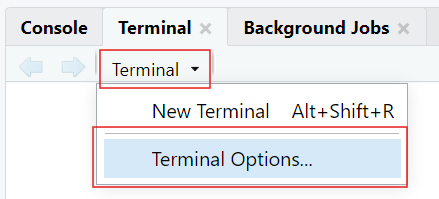{fig-alt="The 'Terminal Options...' selection is highlighted with a red rectangle under the options in Terminal within RStudio."}

:::
::: column
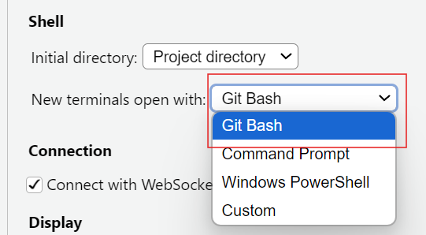{fig-alt="A screenshot displaying the 'Git Bash' option being selected from the dropdown menu under 'New terminals open with:'."}

:::
::::::

::: {.notes}
**Presenter Notes**: When publishing to GitHub, we’ll often work directly in the Terminal in RStudio. To use Git Bash, which is a command-line tool for running Git commands typically on Windows devices, directly inside RStudio: go to "Terminal" then "Terminal Options", and under "New terminals open with", select Git Bash. Then, when you click "Terminal" then click "New Terminal", it will open Git Bash automatically, ready for you to start working. This setup keeps everything in one place so you don’t need to switch between RStudio and an external terminal.

On macOS and Linux, RStudio already opens a compatible terminal, so Git works without any additional setup.

**Instructor Notes**: Git Bash needs to be installed on the learners' device for this to work. When you click the drop-down arrow by Terminal, the options may look different than what's in the image in this slide, but the "Terminal Options..." will be at the end (you may have to scroll a bit). The last step (open a new Terminal) is important because the current Terminal does not automatically change to Git Bash.
:::

--- 

## Practical exercise 10

- [ ] In your Quarto Document, edit the YAML by adding the following:

```mardown
project:
  type: website
  output-dir: docs
```
- [ ] Open a new Terminal (for Windows users, first set to open with Git Bash)
- [ ] Change the working directory of the Terminal to the folder containing your Quarto files: do this by entering `cd` followed by the file path on your device wrapped in quotations

Here is an example of setting the directory using `cd`: 
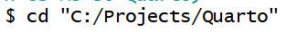{width="50%" fig-alt="Screenshot of the Terminal with the 'cd' command setting the directory to 'Quarto'."}


::: {.notes}
**Presenter Notes**: In this exercise, we are preparing our Quarto document for it to be published on GitHub Pages. First, edit the YAML header of your Quarto document to define it as a 'website project' and set the output to the 'docs' folder. This tells Quarto where to place the rendered files that GitHub Pages will serve. If necessary, set up your terminal in RStudio to use Git Bash by following the steps in the previous slide (Windows users). From this new Git-compatible Terminal, use the `cd` command to change the directory to the main folder where your Quarto files are stored. This step makes sure any Git commands you run are applied in the right project folder. 

**Instructor Notes**: 
The new YAML header will look like this:

``` yaml
---
title: "ChickWeight Analysis"
author: "Your Name"
format:
  html:
    code-fold: true
    code-tools: true
    toc: true
bibliography: references.bib
project:
  type: website
  output-dir: docs
---
```

Some level of Git and Git Hub knowledge is assumed but here are some common issues that the students can run into: 

- A note on copying and pasting: copying and pasting with keyboard shortcuts do not work the same in the Terminal. Right-clicking and selecting "Paste" is an easy option.

Setting the directory can be tricky
- Backslashes (`\`) need to be changed to forward slashes (`/`)
- If you are pasting the exact path of the folder, wrap it in quotation marks (`"..."`); An easy way to change the directory is by typing `cd` then clicking and dragging the folder directly into the Terminal- this puts the folder path after the `cd`

Sometimes in the Terminal, just copying and pasting will run the command, but you often need to hit "Enter".
:::

---

## Practical exercise 10

- [ ] Copy the following and make a simple `_quarto.yml` file by running it in the Terminal:

```{.textbox}
echo "project:
  type: website
  output-dir: docs" > _quarto.yml
```
- [ ] Next, copy the following and run it in the Terminal to add a `.nojekyll` file:

```{.textbox}
touch .nojekyll
```

:::callout-note
## Why we add `.nojekyll`

Adding a `.nojekyll` file to the root of your repository tells GitHub Pages not to do additional processing of your published site using Jekyll
:::

::: {.notes}
**Presenter Notes**: Here, we’re setting up the basic project files GitHub Pages needs in order to publish our Quarto website. First, we’ll create a `_quarto.yml` file using the Terminal. This file tells Quarto that the project is a website and that the rendered output should go into the docs folder. Next, we’ll add a special file called `.nojekyll`. By default, GitHub Pages uses Jekyll to process websites, but that can interfere with Quarto’s output. Adding a `.nojekyll` file tells GitHub Pages to leave our site exactly as Quarto created it.

**Instructor Notes**: By "run in the Terminal", it means to copy & paste the commands provided and run it in the Terminal. Keep in mind:

- Pasting text in terminals may not work with keyboard shortcuts, safest option is to right-click and select "Paste"
- Sometimes simply pasting the text runs the command and other times you need to hit Enter/Return on your keyboard to run the command
:::

---

## Practical exercise 10

- [ ] Copy and run the following in Terminal to generate HTML in the `docs/` folder:

```{.textbox}
quarto render
```
- [ ] Copy into the terminal and run the following- this initializes Git and renames "master" to "main":

```{.textbox}
git init
git branch -M main  
```

::: {.notes}
**Presenter Notes**: Running `quarto render` in the Terminal takes your Quarto project and produces the HTML files in the docs folder. These are the files GitHub Pages will serve as your website. Next, we need to initialize Git in the project folder so we can connect it to GitHub. The command `git init` sets up Git tracking, and `git branch -M main` renames the default branch from "master" to "main," which is the standard branch name used in this session.

**Instructor Notes**: Running `quarto render` here does not open or preview your website- It is building the website by generating HTML files and placing them in the docs/ folder.

You may see a warning about "`references.bib not found in resource path`" which usually happens because Quarto looks for the file in the project’s root or resource path, but the Terminal is case-sensitive and strict with paths. So, you will see in your completed Git Pages web page that the citations look strange, but we will leave it like that for now. Extra steps are needed to correct this that will not be covered in this lesson but can be explored further independently. 
:::

---

## Practical exercise 10

- [ ] Go to [GitHub](github.com) and create a new repository
- [ ] In the Terminal, connect to a local project by using "`git remote add origin`" followed by the repo's HTTPS URL (for example, "`git remote add origin https://github.com/yourname/chickweight-exercise.git`")
- [ ] Copy and run following into the Terminal to render your site and push it to GitHub:

```{.textbox}
quarto render
git add docs
git commit -m "Publish site to docs/"
git push -u origin main
```

- [ ] In your repo on [GitHub](github.com), go to Settings 
- [ ] Click "`Pages`" to configure GitHub Pages

::: {.notes}
**Presenter Notes**: Now to put everything together. We need to create a new, public repository on GitHub which is where our project files will be held. Then, we connect our local project to GitHub using `git remote add origin` followed by the repository’s HTTPS link (found on the GitHub website). This tells Git where to send the files when we push them with `git push -u origin main`. Then, go to the settings in your newly created repository and click "Pages" to configure GitHub Pages.

**Instructor Notes**: For this to work, it is important that the repository created is set to 'Public'.
:::

---

## Practical exercise 10

:::::: {style="display: flex; gap: 1em;"}
::: {style="flex: 1;"}

- [ ] Change "`none`" to "`main`"

:::
::: {style="flex: .65;"}
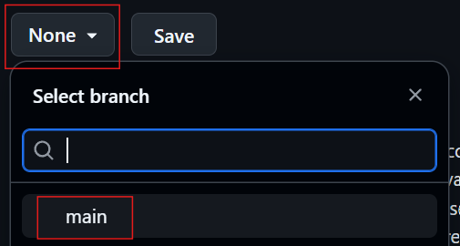{fig-alt="A screenshot of the settings on a GitHub repository where the action of changing 'None' to 'main' branch is highlighted with red rectangles."}

:::
::::::

:::::: {style="display: flex; gap: 1em;"}
::: {style="flex: 1;"}
- [ ] Change "`/root`" to "`/docs`" 
- [ ] Click "`Save`"
:::
::: {style="flex: .65;"}
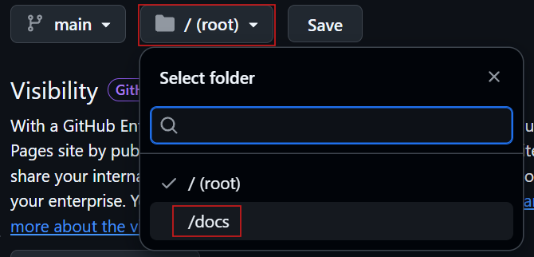{fig-alt="A screenshot of the settings on a GitHub repository where the action of changing '/root' to '/docs' is highlighted with red rectangles."}

:::
::::::

- After 1-2 minutes, you will see that your site will be **live**! 

::: {.notes}
**Presenter Notes**: The final steps to make the site public is to configure the GitHub repository settings under "Pages." Change "None" to "main"- this switches us to the branch we are working on. Then change "/(root)" to "/docs" which will switch the folder where Quarto rendered the website files. After clicking Save, your site will be live after a minute or two. 

**Instructor Notes**: Reminder that the citations will not be complete because configuring to include the bibliography was not done. That's an additional step.
:::

---

## Recap 

:::incremental
- **Quarto** is a powerful tool that combines text, code, and media to make documents more transparent, reproducible, and accessible.
- Within a **.qmd file**:
  - The **YAML header** controls the document settings, such as how code chunks are displayed.
  - **Code chunks** run code and show results. 
  - **Markdown text** creates the main content and can be formatted using keyboard shortcuts.
- Use Quarto directly with **Zotero** for inserting and managing references.
- Make your work accessible and reproducible by publishing on platforms, such as **GitHub Pages**,  your own **website** or **Quarto Pub**.

:::

<div style="text-align: center;">
  <a href="assets/OS-M3-S6-Quarto-Cheatsheet.pdf" download 
     style="background-color:#007ACC; color:white; padding:8px 14px; border-radius:4px; 
            text-decoration:none; font-weight:500;">
    Download the Quarto cheatsheet
  </a>
</div>

::: {.notes}
**Speaker Note**: Here are some of the key things covered in the lesson that give a general overview of Quarto and what it contains. Quarto is more than just a tool to write documents, it’s designed to bring together text, code, and media in one .qmd file that ensures transparency and reproducibility. It makes writing cleaner and more efficient without the need for complex styling tools. Zotero integration streamlines citation management and bibliography building, which is essential for academic and research writing. Quarto enables sharing work through platforms like Quarto Pub or GitHub Pages, which makes research accessible and reproducible. <br>
- For quick reference, a downloadable cheatsheet is provided with this lesson. It offers beginner-friendly instructions summarizing the key terms, features, and functions of Quarto. 

**Instructor Note**: The idea of this slide is to give a recap of important elements about Quarto covered in the lesson, things you can do to edit the Quarto document, and then how to make it shareable.

- A downloadable cheatsheet is included for students to have a summary of information and features that were covered in this session.
:::

---

## Relevance and implications

Let's discuss how useful **Quarto** can be for **open research**. Consider the following questions:

1. How can using Quarto improve transparency and reproducibility in your work?
2. Do you see advantages in using Quarto compared to traditional tools like Word or PowerPoint?
3. What challenges might you face in adopting Quarto in your current workflow?

::: {.notes}
**Speaker Note**: Let's discuss how these new skills could be applied in practice with specific examples. Go through the questions on the slide to add to the discussion. Wirte down some notes for yourself first for two minutes, then discuss in pairs for five minutes. 

**Instructor Note**: The goal with this activity is to work out the relevance of the topic to your students, examine downfalls, and practical obstacles in an interactive setting. Make use of the think-pair-share paradigm.
:::

---

## What is the take-home message?

Let’s wrap up by identifying the **key takeaway** from today’s session together.

<br>

<div style="background-color: #f0f0f0;">
**Ask yourself**: *"If you had to explain to a colleague in one sentence why learning Quarto matters for research and teaching, what would you say?"*
</div>

::: {.notes}
**Presenter Notes**: Think about the question on the slide and either answer it or use it to share a one-sentence take-home message. 

**Instructor Notes**: 
- Aim: End lesson on clear take-home message that are interactively compiled by students.
- You can collect them verbally or in a shared doc/board. 
- If you choose to contribute to the discussion, reinforce that Quarto is not just a tool, but a mindset shift toward openness and collaboration.
:::

---

## Assignment

After learning about Quarto in today's lesson, use this homework assignment to:

- **Practice** your Quarto skills
- **Explore** what more can be added to your documents
- **Build confidence** in editing YAML header, adding code chunks, and customizing the layout

<div style="text-align: center;">
  <a href="assets/OS-M3-S6-Quarto-Activity_Sheet.pdf" download 
     style="background-color:#007ACC; color:white; padding:8px 14px; border-radius:4px; 
            text-decoration:none; font-weight:500;">
    Download the Quarto Activity Sheet
  </a>
</div>

::: {.notes}
**Presenter Notes**: This homework activity builds on the document created during this lesson to add more to the content and layout. It contains activities that take what we practiced today one step further. Each item builds on the knowledge and exercises that were covered in this session. 

**Instructor Note**: 
- Aim- to reinforce what was learned in this session and to have an opportunity to apply the knowledge in a more challenging way. Use this activity sheet for a homework assignment as it is or use it as an example to create your own based on the needs of the class or the specific requirements for future lessons. Consider the following: 

- Examine whether/how it will be assessed 

- Mention scoring rubrics, if applicable

- Design a peer-review system for assignments to place students in role of reviewer and author
:::

---

## To conclude: Survey/Quiz time!

Let's end this session with a short quiz on topics covered in this lesson. 


::: {.notes}
**Presenter Notes**: To end this lesson, let's use this survey to see where we stand in our knowledge of Quarto and what we can focus on more moving forward to become more proficient in literate programming with it. 

*Instructor Notes* Aim- This post-submodule survey serves to examine students' current knowledge about the sumodule's topic. <br>
- Use free survey software such as or other survey software (particify, formR) to establish the following questions (these are examples that can be adapted to suit your needs):
:::

---

**On a scale of 1 to 5, what is your level of familiarity with Quarto now after the session (e.g., Quarto concepts, tools within Quarto)? (1 = Not familiar at all, 5 = Very familiar)**

a. 1

b. 2

c. 3

d. 4

e. 5


---

**Which of the following best describes Quarto?**

a. quarto is a programming language

b. Quarto is a publishing system for reproducible documents

c. Quarto is a code editor

d. Quarto is a version control system

---

**Which components are combined in the authoring process of Quarto documents?**

a. Only YAML

b. Only Markdown

c. Both YAML and Markdown

d. None of the above

---

**Which of these are examples of Markdown text formatting? (Select all that apply)**


a. Bold text

b. Code chunks

c. Hyperlinks

d. Italic text

---

**What is the purpose of code chunks in Quarto documents?**

a. To include executable code and results within the document

b. To hide metadata

c. To insert references at the end of the document

d. To format text in a clear and concise manner

---

**Why is including code in research documents important?**

a. To make the document more difficult to read

b. To ensure only the author can reproduce results

c. To replace data collection

d. To make research reproducible and transparent

---

## Discussion of survey results

::: {.notes}
**Presenter Notes**: To end off, we can use the answers from this survey to see how much we know about Quarto after this lesson and where we should focus and explore more moving forward if we are to become proficient in using it. 

**Instructor Notes**: If there's still time, briefly examine the answers given to each question interactively with the group to compare and highlight specific differences in answers among the group.
:::

---

## References

::: {.small}
- Allaire, J., Teague, C., Scheidegger, C., Xie, Y., Dervieux, C., & Woodhull, G. (2025). Quarto (Version 1.8) [Computer software]. https://doi.org/10.5281/zenodo.5960048

- Bregendahl, K., Sell, J., & Zimmerman, D. (2002). Effect of low-protein diets on growth performance and body composition of broiler chicks. *Poultry Science*, *81*(8), 1156–1167. [https://doi.org/10.1093/ps/81.8.1156](https://doi.org/10.1093/ps/81.8.1156)

- Duit, R., & Treagust, D. F. (2003). Conceptual change: A powerful framework for improving science teaching and learning. *International Journal of Science Education*, *25*(6), 671–688. [https://doi.org/10.1080/09500690305016](https://doi.org/10.1080/09500690305016)

- Forehand, M. (2010). Bloom’s taxonomy. *Emerging perspectives on learning, teaching, and technology*, *41*(4), 47-56.

- Li, J., Yuan, J., Miao, Z., Song, Z., Yang, Y., Tian, W., & Guo, Y. (2016). Effect of Dietary Nutrient Density on Small Intestinal Phosphate Transport and Bone Mineralization of Broilers during the Growing Period. *PLOS ONE*, *11*(4), e0153859. [https://doi.org/10.1371/journal.pone.0153859](https://doi.org/10.1371/journal.pone.0153859)

- Pauwels, J., Coopman, F., Cools, A., Michiels, J., Fremaut, D., De Smet, S., & Janssens, G. P. J. (2015). Selection for Growth Performance in Broiler Chickens Associates with Less Diet Flexibility. *PLOS ONE*, *10*(6), e0127819. [https://doi.org/10.1371/journal.pone.0127819](https://doi.org/10.1371/journal.pone.0127819)

- Ryba, R., Doubleday, Z. A., Dry, M. J., Semmler, C., & Connell, S. D. (2021). Better Writing in Scientific Publications Builds Reader Confidence and Understanding. *Frontiers in Psychology*, *12*, 714321. [https://doi.org/10.3389/fpsyg.2021.714321](https://doi.org/10.3389/fpsyg.2021.714321)

- Tierney, N. (2025). Quarto for scientists. https://qmd4sci.njtierney.com/
:::

---

# Thanks! <br>

See you next class :)

---

## Pedagogical add-on tools for instructors

- Relevant practical exercises follow each section to encourage students to learn-by-doing
- <a href="assets/OS-M3-S6-Quarto-Cheatsheet.pdf" download>Downloadable cheatsheet as a PDF</a> for a compact summary of all the topics covered in the session 
- <a href="assets/OS-M3-S6-Quarto-Activity_Sheet.pdf" download>Downloadable activity sheet as a PDF</a> to learn additional Quarto features, designed with slightly less guidance so that students are encouraged to apply their knowledge and skills more independently. 
- [Link to advanced Quarto activities](https://lmu-osc.github.io/introduction-to-Quarto/quarto_exercises.html) for faster learners who want to gain deeper knowledge on Quarto and its possibilities

---

## Additional literature for instructors

- **References for content**
  - <https://quarto.org/docs/guide/>
- **References for pedagogical add-on tools**
  - <https://quarto.org/docs/presentations/>
  - [Bloom's Taxonomy](https://health.ucdavis.edu/mdprogram/curriculum/pdfs/blooms-taxonomy-vanderbilt.pdf)
  - [Information on conceptual change theory](https://www.researchgate.net/publication/255659929_Conceptual_change_A_powerful_framework_for_improving_science_teaching_and_learning)
- **Other resources**
  - [Video on crafting presentations with R and Quarto](https://www.youtube.com/watch?v=01KifhHDkFk)

---
